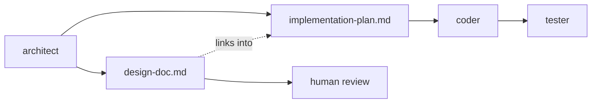

# How It Works

This document has two halves, and they are independent of each other.

**[The pipeline](#the-pipeline)** covers what happens during a run and the rules
that keep it honest. Read it to understand the product.

**[Distribution](#distribution)** covers how one repo delivers the same agents to
three different tools, what `install.sh` creates, and how to extend it. Read it
to understand the plumbing.

## The pipeline

### The shape of a run

Every run is the same chain of handoffs. The five commands differ only in which
links are present and who approves each one.

```
   PM   ->   Architect   ->   Coder   ->   Tester   ->   your diff
feature.md  impl-plan.md    the code    test-results.md
            design-doc.md
```

| Command | PM | Architect | Plan review | Coder | Code review | Tester | Gates |
|---|:--:|:--:|:--:|:--:|:--:|:--:|---|
| `/build-guided` | yes | yes | | yes | | yes | Human, at every boundary |
| `/build-auto` | | yes | | yes | | yes | None |
| `/build-auto-reviewed` | | yes | yes | yes | yes | yes | Automated reviewers |
| `/plan-research` | yes | | | | | | Stops after the PM |
| `/plan-design` | | yes | | | | | Stops after the Architect |

The orchestrator is whatever agent your tool runs at the top level. It spawns
each specialist as a subagent, waits for that agent's DONE marker, and only then
advances.

### Phase outputs

Artifacts live in `pipeline_artifacts/{feature-slug}/`, one folder per feature,
with the slug lowercase and hyphenated (for example `background-link-checks`).

| Agent | Writes | DONE marker |
|---|---|---|
| `adt-android-pm` | `feature.md` | `✅ PM DONE` |
| `adt-android-architect` | `implementation-plan.md`, and `design-doc.md` when the command asks for one | `✅ ARCHITECT DONE` |
| `adt-android-coder` | Nothing. Only uncommitted code | `✅ CODER DONE` |
| `adt-android-tester` | `test-results.md` | `✅ TESTER DONE`, or `⛔ TESTER BLOCKED` |

The Tester is the only agent with two terminal markers, because it is the only
one that depends on hardware. See [When the Tester is
blocked](#when-the-tester-is-blocked).

Reviewers write nothing at all. They are read-only by design, and each ends with
exactly one verdict marker.

| Agent | Verdicts |
|---|---|
| `adt-android-architect-reviewer` | `✅ PLAN APPROVED` or `🔧 PLAN CHANGES REQUESTED` |
| `adt-android-code-reviewer` | `✅ CODE APPROVED` or `🔧 CODE CHANGES REQUESTED` |

A `🔧 CHANGES REQUESTED` verdict is always followed by a numbered list. The
producing agent applies every fix, since a reviewer never edits what it reviewed.

### Artifacts and their audiences

Each artifact has exactly one intended reader, and that is what shapes how it is
written.

| Artifact | Written by | Read by |
|---|---|---|
| `feature.md` | PM | The Architect, and you at the spec gate |
| `implementation-plan.md` | Architect | The Coder, both reviewers, and the Tester |
| `design-doc.md` | Architect | **You.** Whoever maintains this later |
| `test-results.md` | Tester | The Coder on failures, and you |



`implementation-plan.md` is a build contract: exact paths, line numbers, code,
and UI selectors. That is the right document for a Coder and the wrong one to
hand a senior engineer who has to decide whether the approach is sound. The
design doc is that second document — prose, one diagram, the alternatives that
lost, the blast radius, and the rollback story, in 1500 to 3500 words.

The Architect writes both in one phase, **the design doc first**. It has just
surveyed the codebase and weighed the alternatives at that point; a document
summarised from the plan afterwards degrades into a digest of the plan's
headings, which is the one thing it must not be.

Nothing downstream consumes the design doc. The Coder, the Tester, and the code
reviewer all keep reading the plan. The plan reviewer also reviews the design doc
when one was generated.

Which commands produce one, and how to override that per run, is in
[README.md](README.md#the-design-doc). The rules the Architect and the
orchestrator follow are in Part A of the pipeline doc, under "The Two Architect
Artifacts".

### Handoff rules

**Read before write.** Every agent reads the prior phase's artifact in full
before starting. A missing required artifact is a stop condition, not something
to guess around.

**The Coder never commits.** No `git add`, no `git commit`, no staging of any
kind. Work stays uncommitted for you to review, and anything found staged is
itself a review finding.

**The plan wins.** Two documents describing one feature is one chance to
disagree, so `implementation-plan.md` stays the sole contract for
implementation. The design doc explains the change and links into the plan for
detail, and where the two differ the plan is what the Coder builds. Hand-editing
`design-doc.md` never reaches the Coder.

**Feedback lands in the documents.** Answering an approval gate with
`revise: <feedback>` re-runs the Architect, which rewrites both files in place.
Scope that is *declined* — by you withdrawing it, or by the Architect judging it
out of scope — is recorded under the design doc's **Non-Goals** with the
justification, rather than dropped. Feedback that lives only in the chat
transcript is lost the moment the run ends, and a design doc that absorbs every
request without argument is how scope creep enters.

**Artifacts stay out of git.** `pipeline_artifacts/` is ignored two redundant
ways. `install.sh` adds it to the managed `.gitignore` block, and whichever agent
first creates the directory also writes `pipeline_artifacts/.gitignore`
containing a single `*` line. The second mechanism is what covers a plugin-only
install, where no `install.sh` run ever happened. Without either one, run scratch
files would show up in the reviewer's changed-file manifest, and in the commit of
anyone who ran `git add -A` over the Coder's uncommitted tree.

### Review currency

A `✅ CODE APPROVED` verdict applies to the tree that existed when it was issued,
not to the feature in the abstract. Any code change after that verdict
invalidates it.

That is why the Tester's fix loop re-enters the code reviewer:

```
Tester -> NEEDS FIXES -> Coder -> targeted re-review -> Tester -> ...
```

The re-review is targeted rather than a repeat of the full gate. It sees only
what changed since the last approval, plus the fix instructions the Coder worked
from, and it gets one Coder re-run. If the reviewer still objects, the run stops.
Unreviewed code is never re-tested.

> **Invariant:** the tree handed back to you passed code review after its last
> change.

Without that rule a run can reach `READY TO MERGE` carrying code no reviewer ever
read. Tests prove the feature behaves, not that the code making it behave is
sound.

### Required unit tests

Unit tests are specified by the Architect and written by the Coder. No other
agent authors them — reviewers are read-only, and the Tester drives the running
app rather than writing Kotlin.

The requirement travels in the plan. Section 1 records the project's **Test
Stack**, discovered from its version catalog and an existing test, so the Coder
uses the libraries the project already has rather than picking its own. Each
section in Section 3 then carries a **Tests required** field naming the test
file and one case per line.

Every case is phrased GIVEN / WHEN / THEN — starting state, the single action
under test, observable result — and that line becomes the test's name
unchanged, with the body repeating the three steps as commented blocks:

```kotlin
@Test
fun `GIVEN the cache holds items WHEN the refresh fails THEN the cached items are returned`() = runTest {
    // GIVEN
    val repository = NewsRepository(api = FailingApi(), cache = cache)

    // WHEN
    val result = repository.refresh()

    // THEN
    assertThat(result).isEqualTo(cachedItems)
}
```

The point is not ceremony. A case that cannot be phrased this way usually is
not a behaviour, so the format catches empty tests at planning time, before
anyone writes them. And when one fails months later, the name alone says which
behaviour broke and under what starting state.

| Field value | What the Coder does |
|---|---|
| Concrete cases | Writes exactly those, with the Test Stack's libraries |
| `None — <reason>` | Writes none, and says so in its DONE marker |
| Empty or missing | Caught by the plan reviewer as a blocker |

Both reviewers hold a side of this. The plan reviewer checks the fields were
filled in and that the cases are worth writing — a case that only asserts a
constructor assigned its arguments is flagged as fluff, and a `None` on a
ViewModel full of state transitions is a blocker. The code reviewer then checks
the tests actually exist and that each one would fail if the logic were wrong.

> **Invariant:** every unit test the plan requires exists in the tree you are
> handed, and no agent adds a testing dependency the plan did not name.

The build gate runs the project's unit-test task, but that only executes tests
that exist — it can never fail for one that was never written. That is why the
requirement lives in the plan and is checked by a reviewer instead.

### Blocking findings and observations

The Tester classifies everything it finds, and only one class drives code
changes.

| | Blocking | Observation |
|---|---|---|
| **What it is** | Behaviour contradicting the request, the approved plan (including its test plan and platform notes), or the project's conventions. Also crashes, data loss, security problems, and regressions. | Anything no approved artifact asked for: UX opinions, unspecified edge cases, polish, judgment calls. |
| **What it does** | Fails its test case and drives the fix loop | Gets recorded in `test-results.md`, and nothing else |

The verdict follows mechanically. It is `NEEDS FIXES` if and only if there is at
least one blocking finding. Observations never flip the verdict and never reach
the Coder.

> **Invariant:** the Tester discovers defects. It does not create requirements.

When a behaviour genuinely should be required and no artifact requires it, that
is an observation for you to promote into a future request. In `/build-guided`
you can promote one on the spot by feeding it back through `revise:`, which makes
it a real requirement because you created it.

### When the Tester is blocked

The Tester is the one agent that can be stopped by something outside the
repository: an emulator that quietly stops accepting input, a keyguard, a login
it has no account for. It has a third verdict for exactly that, and its own
marker.

| Verdict | Marker | What it means | What happens next |
|---|---|---|---|
| `READY TO MERGE` | `✅ TESTER DONE` | Cases ran, nothing blocking | The run closes |
| `NEEDS FIXES` | `✅ TESTER DONE` | Cases ran, something blocking | The fix loop |
| `BLOCKED` | `⛔ TESTER BLOCKED` | The run could not finish | The ask goes to you |

`BLOCKED` is never `READY TO MERGE` — a case that did not run is not a case
that passed — and it does not enter the fix loop, because a fix cannot be
re-tested on a device that will not take input.

A run can find a real defect and *then* get stopped. When both rules fire,
BLOCKED wins: what has to be acted on is that the run cannot continue. The
defect is not lost — it stays in the report, the `⛔` line says how many are
waiting, and a resumed run carries them forward.

Instead the report gains a **Human Assistance Needed** section: what stopped it,
where, what it already tried, and the one thing it needs from you. The
`⛔ TESTER BLOCKED` line repeats that need in a sentence, so the orchestrator can
relay it without opening the file.

Every build command then puts that ask to you and waits. You reply `resume` —
carrying what it asked for, if it named a credential — or `stop`. There is no
`approve` at this gate, because a run that could not finish its cases is not
something to approve. Two resumes is the limit; after that it stops.

That includes `/build-auto` and `/build-auto-reviewed`. Unattended means nobody
approves the plan, the code, or the results — not that the run may never ask a
question it cannot proceed without. See [Test
credentials](#test-credentials) for why waiting beats stopping here.

> **Invariant:** a blocked run reaches you. It is never absorbed, retried
> silently, or rounded up to a pass.

The failure this replaced was real: a run sent raw `adb shell input keyevent 26`,
locked the screen, then read every dead tap as a broken feature, fell back to
`./gradlew test`, and reported `READY TO MERGE` on a feature it had never seen
run.

### Test credentials

Because the pipeline drives development builds on development devices, the gates
in front of them are gates the Tester may pass — a keyguard PIN or pattern, a
device passcode, a test-account email and password, a 2FA code. It just has to be
handed the values, and only you can hand them over.

You never pass a credential on the command line. There is no `creds:` argument,
because a PIN or a password has no natural end marker the way `doc: on` does —
the command could not tell where your credential stopped and your feature
request resumed without guessing, and a wrong guess writes the PIN into
`implementation-plan.md`.

Instead the Tester asks, using the blocked path it already has:

```
⛔ TESTER BLOCKED — the emulator is locked. I need the device PIN.

you: resume: the PIN is 1234
```

It picks back up at the case it stopped on. The whole reply is the answer to
that one question, so there is nothing to parse apart.

**This works in every flow, including the auto ones.** They are unattended in
the sense that nobody approves the plan, the code, or the results — but a
blocked run is not asking for approval, it is asking for one thing it cannot
proceed without. Stopping instead would discard a finished Architect phase and
a finished Coder phase that a re-run has to pay for again. If nobody is
watching, the run waits, and nothing is lost that stopping would have saved.

Four rules keep that narrow:

- Only the Tester ever receives them. No other agent has a use for one.
- It types only what this run gave it. It does not guess a PIN, read one out of
  the repository or the environment, or reuse another app's stored session — a
  credential it was not handed is one it does not have, and that is a `BLOCKED`.
- No value reaches an artifact: not `test-results.md`, not a screenshot, not a
  recorded plan, not the final summary. Artifacts record *that* a sign-in
  happened. The value stays in the conversation.
- Test accounts only. A gate wanting a real person's account or production
  access is a `BLOCKED`, however it was supplied.

### Retry budgets

Nothing retries forever. Each budget is separate, and exhausting one stops the
pipeline with a report rather than advancing.

| Loop | Budget | On exhaustion |
|---|---|---|
| Plan review gate | 2 re-runs, so 3 attempts | Stops, reporting the gate and the unresolved feedback |
| Code review gate | 2 re-runs, so 3 attempts | Stops, reporting the same |
| Targeted re-review | 1 re-run, per fix iteration | Stops. Does not re-test, and does not spend the remaining Tester iteration |
| Tester fix loop | 2 iterations | Stops. Never declares a `NEEDS FIXES` feature complete |
| Blocked resumes (every build command) | 2 resumes | Stops. A device that will not cooperate is not fixed by more attempts |
| Cross-section check | 2 rounds | Stops, reporting the failing output and the sections involved |

On a gate's second re-run, the producing agent receives all prior feedback from
both rounds, with previously accepted items marked resolved.

### The changed-file manifest

Before reviewing anything, the code reviewer builds a canonical inventory of what
the run touched:

```bash
git status --porcelain
git diff
git ls-files -o --exclude-standard
```

The manifest has four parts, and all four are in scope: tracked modifications,
tracked deletions and renames, untracked new files, and anything staged (which is
a finding in itself).

The untracked part is the one that gets missed, and it is the one that matters
most in feature work. A new repository, ViewModel, and screen are all untracked
until someone commits them, and `git diff` shows nothing for any of them. A
review that reads only `git diff` can approve a feature without seeing a single
line of its implementation.

> **Invariant:** every file the run changed is in the manifest, and every file in
> the manifest is reviewed.

### Verification commands

Three named commands are the only Gradle the pipeline runs.

| Name | What it is | Who runs it |
|---|---|---|
| Build gate | The full end-of-work check | The Coder in a sequential run, before declaring done. Also the code reviewer, as part of every review |
| Cross-section check | The build gate minus the assemble task | The orchestrator, after every parallel coder group |
| Install command | Puts the build on the device | The Tester, before driving the app. A failure here is a stop condition |

The cross-section check still catches compile errors, because its unit-test leg
compiles the main sources.

The commands are resolved per project and never assumed. Every agent resolves
them in this order and uses the first that applies:

1. **The plan's `## 0. Verification Commands` block.** The Architect discovers the
   real commands against your project and records them there. Once a plan exists
   this is the authority, and downstream agents consume it verbatim.
2. **Your `AGENTS.md` or `CLAUDE.md`**, if it declares verification commands and no
   plan exists yet, such as when an agent is invoked standalone.
3. **The defaults**, which assume a single-module app with `lint` and `detekt`
   applied at the root:

   ```
   build gate:          ./gradlew assembleDebug lint detekt testDebugUnitTest
   cross-section check: ./gradlew lint detekt testDebugUnitTest
   install command:     ./gradlew installDebug
   ```

Those defaults are a starting point, not a contract. `detekt` does not exist in a
project that never applied the plugin, and a multi-module project may need
`:app:assembleDebug` or `:app:lintDebug`. Naming a task the project does not
define fails the whole invocation, so a resolved command that names a missing
task is a defect in the resolution, not a broken build.

### Parallel execution

The Architect decides. Section 3 of the plan carries a **Parallel-safe** field,
and when it is YES the sections are grouped into Execution Groups.

Before spawning anything, the orchestrator runs a pre-check: extract each
section's file list and confirm no file appears in two sections of the same
group. This is a mechanical comparison rather than a judgment call. On overlap it
stops and names the overlapping files and the sections claiming them. It will not
run coders against a plan with a parallelization bug, and in `/build-guided` it
will not even ask you to approve one.

Only the orchestrator runs Gradle, because parallel coders share one working tree
and one Gradle project.

| Role | Runs Gradle? |
|---|---|
| Parallel coder | No. It implements its section, confirms nothing is staged, and declares done |
| Sequential coder (`Parallel-safe: NO`, a reviewer-driven fix, or a Tester-driven fix) | Yes, the build gate. It is the only agent touching the tree, so the result means something |
| Orchestrator | Yes, the cross-section check, after every group |

This is not a style preference. Concurrent Gradle invocations against one project
directory contend on the locks under `.gradle/` and write to the same `build/`
outputs, which produces lock timeouts and non-deterministic failures. Each
coder's build would also be compiling files its siblings are still editing, so a
failure would say nothing about the coder that ran it.

That is why the cross-section check runs after every group, including a group
with only one section. Parallel coders run no Gradle at all, so a skipped check
means that group's work was verified by nothing.

### When the cross-section check fails

A failure here is in scope for the run, since catching it is what the check
exists for. The orchestrator resolves it rather than reporting and stopping:

1. Attribute each failure to the section that owns the file, using the plan's
   per-section file lists. A failing unit test is attributed the same way, by
   the section whose file list holds that test file.
2. Re-spawn the owning coder, one at a time and never concurrently. A sequential
   fix coder does run the build gate.
3. Re-run the check. Allow at most 2 rounds, then stop.
4. If a failure cannot be attributed to a single section, because it is a genuine
   integration defect or two sections' public interfaces contradict each other,
   stop and report it as a plan defect. Do not guess which coder should absorb
   it.

### Model selection

Each agent file records a recommended model: `opus` for the PM, the Architect,
and both reviewers, and `sonnet` for the Coder and the Tester.

Claude Code honours those per agent. Antigravity and OpenCode do not support
per-subagent model selection, so every subagent inherits your globally selected
model. Select the strongest model available before a full pipeline run in those
tools.

## Distribution

### How the three tools find the files

This repo is a shared configuration package rather than a library you import.
Each Android project that wants the pipeline links this repo's files into its own
`.claude/`, `.agents/`, and `.opencode/`. Six mechanics make that work.

1. **Per-file symlinks, never per-directory.** Your `.claude/`, `.agents/`, and
   `.opencode/` stay real directories. You can keep adding your own commands and
   agents alongside ours, and they coexist freely.
2. **Claude Code discovery.** Claude Code scans `.claude/commands/` and
   `.claude/agents/` by filename. Our symlinks sit at those canonical paths, so
   all five commands and all six `@adt-*` agents are available automatically.
3. **Antigravity discovery.** Antigravity scans `.agents/workflows/` for slash
   commands and auto-loads `.agents/agents.md` into the system prompt as
   user_rules. `install.sh` inlines the persona stubs from this repo's
   `.agents/AGENTIC_DEV_TEAM.md` into a marker-fenced block in your `agents.md`,
   so Antigravity sees them in context without loading another file. The
   HTML-comment markers are ignored by Antigravity itself.
4. **OpenCode discovery.** OpenCode scans `.opencode/commands/` for slash commands
   and `.opencode/agents/` for subagents. Each agent file is a `mode: subagent`
   stub whose body reads its canonical prompt from `.claude/agents/adt-*.md`, so
   the orchestrator can delegate to `@adt-android-architect` and the rest with an
   identical persona. No `agents.md` inlining is needed, because the per-file
   definitions are the discovery mechanism.
5. **One source of truth across all three.** Every tool ends up reading the same
   agent prompts and the same `AGENTIC_DEV_TEAM_PIPELINE.md`. Edit those in the
   clone and every consuming project picks the change up on the next file read,
   with no re-install required for in-place edits.
6. **A managed `.gitignore` block.** Symlink targets are per-developer absolute
   paths such as `~/code/agentic-dev-team/...`, which would not resolve on a
   teammate's machine, so `install.sh` maintains a small block listing them.

### What install.sh creates

For every file this repo owns, `install.sh` creates a symlink at the matching
path inside your project.

| Project path | Symlink target in your clone |
|---|---|
| `.claude/commands/build-guided.md` | `<clone>/.claude/commands/build-guided.md` |
| `.claude/commands/build-auto.md` | `<clone>/.claude/commands/build-auto.md` |
| `.claude/commands/build-auto-reviewed.md` | `<clone>/.claude/commands/build-auto-reviewed.md` |
| `.claude/commands/plan-research.md` | `<clone>/.claude/commands/plan-research.md` |
| `.claude/commands/plan-design.md` | `<clone>/.claude/commands/plan-design.md` |
| `.claude/agents/adt-android-pm.md` | `<clone>/.claude/agents/adt-android-pm.md` |
| `.claude/agents/adt-android-architect.md` | `<clone>/.claude/agents/adt-android-architect.md` |
| `.claude/agents/adt-android-architect-reviewer.md` | `<clone>/.claude/agents/adt-android-architect-reviewer.md` |
| `.claude/agents/adt-android-coder.md` | `<clone>/.claude/agents/adt-android-coder.md` |
| `.claude/agents/adt-android-code-reviewer.md` | `<clone>/.claude/agents/adt-android-code-reviewer.md` |
| `.claude/agents/adt-android-tester.md` | `<clone>/.claude/agents/adt-android-tester.md` |
| `.claude/AGENTIC_DEV_TEAM_PIPELINE.md` | `<clone>/.claude/AGENTIC_DEV_TEAM_PIPELINE.md` |
| `.agents/workflows/build-guided.md` | `<clone>/.agents/workflows/build-guided.md` |
| `.agents/workflows/build-auto.md` | `<clone>/.agents/workflows/build-auto.md` |
| `.agents/workflows/build-auto-reviewed.md` | `<clone>/.agents/workflows/build-auto-reviewed.md` |
| `.agents/workflows/plan-research.md` | `<clone>/.agents/workflows/plan-research.md` |
| `.agents/workflows/plan-design.md` | `<clone>/.agents/workflows/plan-design.md` |
| `.opencode/commands/build-guided.md` | `<clone>/.opencode/commands/build-guided.md` |
| `.opencode/commands/build-auto.md` | `<clone>/.opencode/commands/build-auto.md` |
| `.opencode/commands/build-auto-reviewed.md` | `<clone>/.opencode/commands/build-auto-reviewed.md` |
| `.opencode/commands/plan-research.md` | `<clone>/.opencode/commands/plan-research.md` |
| `.opencode/commands/plan-design.md` | `<clone>/.opencode/commands/plan-design.md` |
| `.opencode/agents/adt-android-pm.md` | `<clone>/.opencode/agents/adt-android-pm.md` |
| `.opencode/agents/adt-android-architect.md` | `<clone>/.opencode/agents/adt-android-architect.md` |
| `.opencode/agents/adt-android-architect-reviewer.md` | `<clone>/.opencode/agents/adt-android-architect-reviewer.md` |
| `.opencode/agents/adt-android-coder.md` | `<clone>/.opencode/agents/adt-android-coder.md` |
| `.opencode/agents/adt-android-code-reviewer.md` | `<clone>/.opencode/agents/adt-android-code-reviewer.md` |
| `.opencode/agents/adt-android-tester.md` | `<clone>/.opencode/agents/adt-android-tester.md` |

The canonical `AGENTIC_DEV_TEAM_PIPELINE.md` lives in
`plugins/agentic-dev-team/` so the Claude Code plugin can package it. The clone's
`.claude/AGENTIC_DEV_TEAM_PIPELINE.md` is a symlink to it, which leaves the
project-side path above unchanged, so installed projects need no re-install.

Two further changes happen through marker-fenced managed blocks rather than
symlinks.

**`.gitignore`** gains a block listing the symlink paths above, plus
`/pipeline_artifacts/`. This block only exists on the `install.sh` path. See
"Handoff rules" above for what covers a plugin-only install.

**`.agents/agents.md`** gains a block containing the inlined persona stubs from
this repo's `.agents/AGENTIC_DEV_TEAM.md`. The file is created if it does not
exist, and your content outside the markers is left untouched.

After install, `ls -la .claude/commands/` makes ownership obvious. Our entries
show an arrow pointing into the clone, and yours do not.

### Refusal behavior

If a real file, or a symlink that is not ours, already sits at one of our
destinations, `install.sh` refuses with the path and a "rename or delete, then
re-run" message. Nothing is ever overwritten silently. Collision checks run
pre-flight, before any symlink is created, so a refusal leaves the install in a
clean state.

### Extending the pipeline

This section is for maintainers and contributors.

**Adding an agent.** Create `.claude/agents/adt-<name>.md`, always with the
`adt-` prefix so it never collides with a developer's own agents. Add a short
stub to `.agents/AGENTIC_DEV_TEAM.md` using the `@adt-<name>` handle and
referencing the new prompt, for Antigravity. Create
`.opencode/agents/adt-<name>.md` as a `mode: subagent` stub whose body reads the
canonical prompt, for OpenCode. On the next `install.sh` run in each project,
`@adt-<name>` becomes invocable in all three tools and the `agents.md` block
updates itself.

**Adding a command.** Create `.claude/commands/<name>.md` with the orchestration
prompt, then create `.agents/workflows/<name>.md` and
`.opencode/commands/<name>.md` as symlinks to `../../.claude/commands/<name>.md`.
`/build-auto-reviewed` was built exactly this way. Its workflow symlinks point at
the command, which orchestrates the two reviewers between the existing phases.

**Changing shared orchestration rules.** Edit the canonical
`plugins/agentic-dev-team/AGENTIC_DEV_TEAM_PIPELINE.md`. Agent prompts reference
it by path and the project copy is a symlink, so edits propagate the next time an
agent reads the file, with no install needed. Agent-facing rules go in Part A and
orchestrator-only rules in Part B, since agents are told to read Part A and stop
there.

**Removing or renaming files.** Just do it in the repo. The sync logic in
`install.sh` removes stale symlinks from consuming projects on the next run.

### Project context

Every `adt-*` agent reads your project's `AGENTS.md` or `CLAUDE.md`, whichever
exists, for stack, architecture, conventions, and verification rules. You do not
need to document the pipeline itself in there, because the agents bring their own
instructions. What they need from you is what makes your codebase specific.

### Troubleshooting

**install.sh refused with "real file at X".** You have your own file at one of our
install paths. Rename or delete one side, then re-run.

**I pulled the repo but new commands are not showing up.** Run `install.sh` in the
project again. `git pull` refreshes files that are already symlinked, but it
cannot materialize symlinks for newly added ones.

**There is a broken symlink in `.claude/agents/`.** A file was probably renamed or
removed upstream. Run `install.sh` and the sync will clear stale symlinks.

**An agent's persona looks out of date in Antigravity.** Persona stubs are inlined
into `.agents/agents.md` at install time rather than symlinked, so re-run
`install.sh` to refresh that block. Agent prompts and the pipeline doc are
symlinked and never need this.

**Both `AGENTS.md` and `CLAUDE.md` exist.** Agents read whichever they find first.
Pick one as canonical and keep them in sync, or delete one.

**The Tester cannot verify on device.** Check that the
[auto-mobile MCP server](https://github.com/kaeawc/auto-mobile) is registered with
your tool and that a device or emulator is attached. In OpenCode it belongs in
`opencode.json` under the `mcp` key, as `type: "remote"` with auto-mobile's URL.

**A run stopped mid-pipeline.** That is the intended behaviour. Every loop is
bounded, as described under "Retry budgets", and a stop reports the gate, the
unresolved feedback, and the current state of the artifacts and diff. The work so
far is still in `pipeline_artifacts/` and in your working tree.
