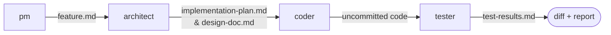
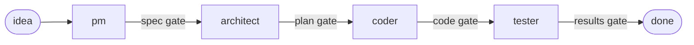
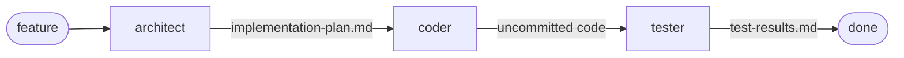
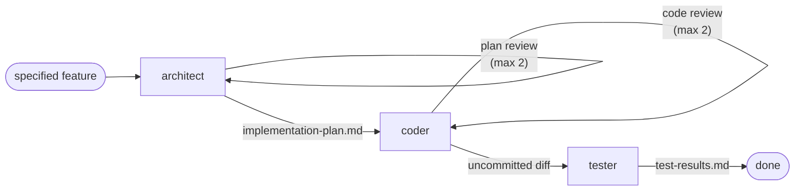

# Agentic Android Dev Team

Six specialist AI agents that work like an Android team. You describe a feature
in your editor's chat prompt, and they pass it down the line: product spec,
implementation plan, code, then testing on a real device. What comes back is an
uncommitted diff and a test report.

Works the same way in [Claude Code](https://claude.com/claude-code),
[Antigravity](https://antigravity.google), and [OpenCode](https://opencode.ai).

## How a run works

Every run is the same chain of handoffs. Each agent reads the previous agent's
output in full before it starts, so the spec constrains the plan, the plan
constrains the code, and the plan's test cases are what the Tester actually runs.



You decide how much of that chain runs and who approves each step. One command
starts from a vague idea and pauses for your sign-off at every boundary, another
runs start to finish unattended, and a third puts an automated reviewer between
the phases. Two more run a single phase and stop.

Written artifacts land in a git-ignored folder for the feature. The code itself
stays uncommitted in your working tree, so you review it and commit on your own
terms.

## Why it is split up this way

A single agent asked to "build this feature" will plan it, write it, and grade
its own work in one pass. This project splits that job across agents with
separate mandates, and puts a reviewer between them.

* The Architect reads your codebase and writes the plan before any code exists.
  It names exact files and line numbers, and records the manual test plan up
  front.
* In guided and plan commands, what you review is a design document, not a diff.
  Deciding an approach is wrong is cheapest before the code exists, and a diff is
  the most expensive place to discover it.
* In the reviewed flow, code review always covers the final state of the tree,
  including fixes made after testing.
* The Tester drives the real app on a device or emulator, not a mocked harness.
* Retry loops are bounded. Reviewers get at most two rounds, the fix loop gets at
  most two, and a run that still fails stops and explains why instead of
  reporting success.
* Nothing is committed for you.

## The agents

| Agent | Role | Output |
|---|---|---|
| `adt-android-pm` | Principal Product Manager | `feature.md`, an unambiguous spec |
| `adt-android-architect` | Staff+ Android engineer | `implementation-plan.md`, with exact file changes and a manual test plan, plus `design-doc.md` for human review |
| `adt-android-architect-reviewer` | Plan reviewer, read-only | Approval, or a numbered list of required changes |
| `adt-android-coder` | Implementer | Uncommitted code in your working tree |
| `adt-android-code-reviewer` | Code reviewer, read-only | Approval, or a numbered list of required changes |
| `adt-android-tester` | Principal QA engineer | `test-results.md`, with a verdict from a real device |

Each agent reads your project's `AGENTS.md` (or `CLAUDE.md`) for stack,
architecture, and conventions, so the output matches your codebase rather than a
generic Android one.

## Commands

Five slash commands. Three run the full pipeline, two stop after a single phase.

| Command | Phases | Who approves | Use it for |
|---|---|---|---|
| `/build-guided` | PM, Architect, Coder, Tester | You, at every phase boundary | A rough idea you want shaped before code exists |
| `/build-auto` | Architect, Coder, Tester | Nobody, it runs start to finish | A feature you have already specified precisely |
| `/build-auto-reviewed` | Architect, Coder, Tester, plus a reviewer after the first two | Reviewer agents, with no human pause | An unattended run you want to trust. Costs more tokens |
| `/plan-research` | PM only | n/a | Turning a vague idea into a spec and nothing more |
| `/plan-design` | Architect only | n/a | Auto-detects input: produces whichever of the plan and design doc is missing |

The two single-phase commands write their artifact and stop. Their output feeds
straight into a `build-*` command later, or into each other.

### /build-guided

```
/build-guided add a recently-played carousel to the home screen
```

The PM asks clarifying questions, writes a spec, and pauses. At each boundary you
reply `approve`, `revise: <feedback>`, or `stop`. Before the Coder runs, you also
see whether the Architect judged the work parallel-safe and how many coder agents
that implies. Reply `force-sequential` to override it and spend fewer tokens.



The plan gate shows you the design doc rather than a dump of plan headings, so
the decision is made at design altitude while changing course is still cheap.
Feedback you give there is rewritten into both documents, including scope you
decline, which is recorded under **Non-Goals** with your reason rather than
dropped.

### /build-auto

```
/build-auto add a "save draft on background" hook to ComposeViewModel that
            persists the current input to Room every 2s and restores it on launch
```

No PM phase and no pauses. If the request turns out to be too vague for the
Architect to plan concretely, the run stops and points you at `/build-guided`.
This is the speed path, so it writes no design doc by default. Pass `doc: on` if
you want one.



### /build-auto-reviewed

```
/build-auto-reviewed add a "save draft on background" hook to ComposeViewModel
                     that persists input to Room every 2s and restores on launch
```

Same shape as `/build-auto`, with an automated reviewer after each producing
phase. The plan reviewer checks the plan against the codebase, Section 0 verification
tasks, and pattern-fit. The code reviewer reads the full set of changes, which includes
every new untracked file, not just what shows up in `git diff`.

When a reviewer requests changes, the producing agent re-runs with that feedback,
at most twice per gate. If the reviewer is still unsatisfied after the second
re-run, the pipeline stops and reports instead of shipping rejected work.



### /plan-research and /plan-design

```
/plan-research add a recently-played carousel to the home screen
/plan-design   pipeline_artifacts/recently-played-carousel/feature.md
/plan-design   pipeline_artifacts/recently-played-carousel/implementation-plan.md
/plan-design   pipeline_artifacts/recently-played-carousel/design-doc.md
```

/plan-research runs the PM alone. `/plan-design` runs the Architect alone. Use
them to think a feature through, or to size the work, without committing to a
build. `/plan-design` produces both of the Architect's files by default, but if
you give it an existing plan or design doc, it writes only the missing one.

`/plan-design` auto-detects what it receives. Hand it an existing
`implementation-plan.md` and it writes the design doc without re-planning. Hand
it an existing `design-doc.md` and it writes the plan without touching the doc.

### The design doc

The Architect writes `implementation-plan.md` (the build contract for agents) and
can also emit `design-doc.md` (for human review). Depending on the command used,
it produces or skips the design doc:

| Command | Design doc | Where you read it |
|---|---|---|
| `/plan-design` | auto-detected | printed to chat upon completion |
| `/build-guided` | on | at the plan approval gate, before any code is written |
| `/build-auto-reviewed` | off | not generated |
| `/build-auto` | off | not generated |

Pass `doc: on` or `doc: off` in the command arguments to override the default for a run.
Where the two documents differ, the implementation plan is the source of truth for code.

## What a run leaves behind

Artifacts land in `pipeline_artifacts/<feature-slug>/`, which is git-ignored:

```
pipeline_artifacts/recently-played-carousel/
├── feature.md              # the spec (PM phases only)
├── implementation-plan.md  # the plan, including the manual test plan
├── design-doc.md           # the same design, written for you
└── test-results.md         # per-case results, verdict, observations
```

Alongside that is the actual work: uncommitted changes in your working tree.
Review them, stage what you want, and commit on your own terms.

## Safeguards

### Testing cannot invent requirements

The Tester only sends work back for *blocking* findings: behaviour that
contradicts your request, the approved plan, or your project's conventions, plus
crashes, data loss, and regressions. Anything else it notices, such as a UX
opinion or an unspecified edge case, is recorded as an *observation* in
`test-results.md` for you to decide on. QA finds defects. It does not get to add
scope mid-run.

### A test that could not run never counts as a pass

The Tester depends on hardware, and hardware stalls: an emulator stops taking
input, a keyguard appears, a screen asks for an account. When that happens it
stops on a third verdict, `BLOCKED`, and ends on `⛔ TESTER BLOCKED` with one
concrete ask — the credential it needs, by name, or the thing only you can do.
Every flow puts that to you and waits, `resume` picks it back up, and two
resumes is the limit. A blocked run is never rounded up to `READY TO MERGE`, and it never
sends a Coder to change working code over a locked screen.

It reaches for the shell the same way. `adb` is not banned — auto-mobile is the
default because it knows which app is under test, but where it falls short the
Tester may use the shell, then re-confirm your app is still in front and record
what it ran. The count appears in the run summary. That way a fallback is a
visible working step rather than the silent screen-lock that produced the false
pass above.

Because these are development builds on development devices, you can also just
tell it the PIN. The blocked run asks for what it needs and your reply carries
it — `resume: the PIN is 1234` — and it picks back up where it stopped. That
holds in the unattended flows too: they skip *approval* gates, but a run that
cannot proceed is worth one question rather than a discarded Architect and
Coder phase. There is no credential syntax on the commands themselves, so there
is nothing to fumble: it types only what you sent in answer to its question,
never guesses a PIN, never lifts one out of your repository or environment, and
never writes one into `test-results.md`, a screenshot, or its summary.

### Unit tests are specified, not left to chance

The Architect names the unit tests each section needs, using the libraries your
project already uses — discovered from your version catalog, not chosen from a
default list. Every case is phrased GIVEN / WHEN / THEN, and that line becomes
the test's name and the shape of its body, so a failing test says which
behaviour broke without anyone opening the file. The Coder writes exactly
those, and both reviewers check them:
the plan reviewer that the cases are worth writing, the code reviewer that they
exist and would fail if the logic were wrong. A section with no logic worth
testing says so explicitly rather than padding itself with tests that cannot
fail.

### Reviews cover the final code

An approval applies to the tree that existed when it was issued. When the Tester
finds a defect and the Coder patches it, a targeted re-review of that patch runs
before the re-test. The tree you are handed has passed review after its last
change, not before it.

### Build commands are discovered, not assumed

The Architect resolves your project's real build, lint, test, and install
commands against your Gradle setup and records them in the plan. A project
without `detekt`, or one that needs `:app:lintDebug` and a `demoDebug` variant,
runs its own commands instead of failing on tasks it never defined.

### Parallel work is checked before it starts

When the Architect marks sections parallel-safe, the orchestrator verifies
mechanically that no file is claimed by two sections in the same group before
spawning anyone, then verifies the result again after every group.

### The installer never overwrites anything

`install.sh` only creates symlinks for files this repo owns. If something of
yours already sits at one of those paths, it refuses and names the path.

## Requirements

* `git`
* One of [Claude Code](https://claude.com/claude-code),
  [Antigravity](https://antigravity.google), or [OpenCode](https://opencode.ai)
* An Android project with an `AGENTS.md` or `CLAUDE.md` describing its stack,
  architecture, conventions, and verification rules
* The [auto-mobile MCP server](https://github.com/kaeawc/auto-mobile) registered
  with your tool. The Tester drives the app on a device or emulator through it,
  and without it the Tester phase cannot finish its device verification.

## Installation

There are two paths, and they are not mutually exclusive.

### Install as a Claude Code plugin

The fastest path if you only use Claude Code. From inside the CLI:

```
/plugin marketplace add jaxvy/agentic-dev-team
/plugin install agentic-dev-team@adt-pipeline
```

This installs all six agents and all five commands with no per-project setup. It
does not wire up Antigravity or OpenCode.

### Install per project with install.sh

This is the only supported path for Antigravity and OpenCode, since neither has a
plugin marketplace. It also works alongside the plugin.

Clone the repo once, anywhere you like:

```bash
git clone https://github.com/jaxvy/agentic-dev-team.git ~/code/agentic-dev-team
```

Then run the installer from each Android project root:

```bash
cd /path/to/your-android-project
~/code/agentic-dev-team/install.sh
```

It links the agents and commands into the project's `.claude/`,
`.agents/workflows/`, and `.opencode/`. Your existing content in those
directories is never touched, modified, or migrated.

### Updating

```bash
cd ~/code/agentic-dev-team && git pull && cd /path/to/your-project
~/code/agentic-dev-team/install.sh
```

`git pull` refreshes edits to existing agents and commands, and those take effect
immediately because your project links to them. Re-running `install.sh` is what
picks up newly added files and clears out removed ones. It is a sync rather than
an append.

### Uninstalling

```bash
~/code/agentic-dev-team/install.sh --uninstall
```

This removes only what it created: its own symlinks, and its marker-fenced blocks
in `.gitignore` and `.agents/agents.md`. Your files and the clone are left alone.

## Further reading

[HOW_IT_WORKS.md](HOW_IT_WORKS.md) covers the pipeline phase by phase, the rules
that keep it honest, how the three tools discover the same files, everything
`install.sh` creates, how to add your own agents and commands, and
troubleshooting.

## Built with this pipeline

This project was used to build
[MaybeLater](https://play.google.com/store/apps/details?id=com.jaxvy.maybelater),
a shipped Android app, as a way to validate that the pipeline holds up on real
work rather than on examples written for a README. You can find the app at
[getmaybelater.app](https://getmaybelater.app) or on
[Google Play](https://play.google.com/store/apps/details?id=com.jaxvy.maybelater).

## License

See [LICENSE](LICENSE).
