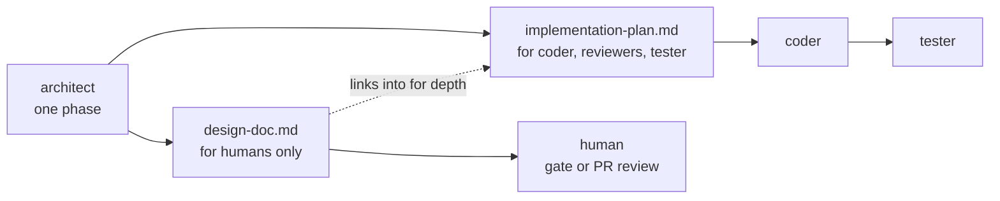

# Implementation Plan: Agentic Dev Team Pipeline

**Date**: 2026-08-14 (consolidates the 2026-07-12 codebase review and the
2026-07-22 design-doc spec)

This document is **four independent pull requests**. Each is written to be
handed to a different implementer, in isolation, at whatever pace suits you.
A PR section contains everything needed to do that PR and nothing that
belongs to another:

| Part of a PR section | What it is |
|---|---|
| **Prerequisites** | What must already be on `main`, and what each earlier PR established that this one relies on. Read this instead of reading the earlier PR. |
| **What ships** | The file-level inventory. |
| **Changes** | The pinned edits. Every either/or is already resolved — no item asks the implementer to choose. |
| **Documentation to ship with it** | The user-facing doc edits that must land in the *same* PR, so the repo never describes a capability it doesn't have. |
| **Acceptance check** | How to know it worked, and — for the PRs that trade something away — how to prove it didn't break what it traded. |

Two sections are shared by all four: **Conventions every PR follows**
(below) and the **Appendix** (empirical evidence, at the end).

Item numbers (`§1.4`, `§2.3`, `§4.6`) are stable identifiers carried over
from the original review; they are referenced across PRs and in the commit
history, so they are not renumbered. The index below maps every one to its
PR.

---

## PR index

| PR | Title | Items | Blocked by | Nature |
|---|---|---|---|---|
| **PR 1** | Correctness & Packaging | §1.1–§1.7, §2.1 | — | Markdown only. Changes what agents *read*, not what any flow does. |
| **PR 2** | Efficiency & Safeguards | §2.2–§2.6, §3.2–§3.6 | PR 1 | Prompt-only. Every item trades review depth for tokens — the risky one. |
| **PR 3** | Flow Enhancements | §4.1–§4.8 | PR 1 | Command behavior. The only PR that changes what a run *does*. |
| **PR 4** | The Human-Facing Design Doc | §5.1–§5.8 | PR 1; §5.5 also needs PR 3 | One new artifact from the existing Architect, plus one optional command. |

**Ordering.** PR 1 first — the other three edit files it restructures, and
resolving that as a merge conflict is worse than waiting. After PR 1, the
remaining three touch mostly disjoint surfaces and can be done in any order
or concurrently, with one exception noted in PR 4's prerequisites. PR 4 is
the cheapest capability to ship and the one that most changes how humans
experience the pipeline; if only one of PRs 2–4 gets done, make it that one.

**Out of scope for all four**: the Tester speed redesign, and a cross-run
codebase map (a shared discovery cache reused across runs). Both need design
work this document does not do.

---

## Conventions every PR follows

The repo keeps one canonical copy of each prompt and fans it out to three
tools by symlink. Getting this wrong is the most common way a correct edit
fails to reach the tool it was meant for.

1. **Edit only canonical files** under `plugins/agentic-dev-team/` (the
   repo-root `.claude/agents` and `.claude/commands` are symlinks into it;
   Antigravity workflows and opencode commands symlink to
   `.claude/commands/`, so they follow automatically).
2. The six `.opencode/agents/adt-*.md` files are **real files, not symlinks**
   — the one place item 1 does not cover. Their bodies are short stubs that
   defer to the canonical prompt, so most edits need no mirroring, but two
   kinds do:
   - a frontmatter **`description:` change** (duplicated verbatim there —
     this is what §1.5 hits);
   - a change to the **paths or markers the stub itself names**: each stub
     hardcodes `.claude/agents/adt-*.md`, `.claude/AGENTIC_DEV_TEAM_PIPELINE.md`,
     and its DONE marker. PR 1 changes none of these — opencode installs
     always run `install.sh`, which materializes the project-side pipeline
     path, so the stubs need no plugin fallback.
3. If an agent's **role, traits, or constraints change** (e.g. §3.5, §4.6),
   update its persona stub in `.agents/AGENTIC_DEV_TEAM.md` to match, and
   note in the changelog that consuming projects must re-run `install.sh` to
   refresh the inlined `agents.md` block.
4. The pipeline-doc move (§1.2) leaves the `HOW_IT_WORKS.md` symlink table
   correct as-is — the *project-side* path is unchanged
   (`.claude/AGENTIC_DEV_TEAM_PIPELINE.md`). Two edits are still needed in
   that file, both listed under "Documentation to ship with PR 1": a one-line note that the canonical file
   now lives in the plugin directory, and an update to the "Updating shared
   orchestration rules" bullet, which today tells contributors to edit
   `.claude/AGENTIC_DEV_TEAM_PIPELINE.md` — still functional through the
   symlink, but it contradicts checklist item 1's "edit only canonical files
   under `plugins/`".
5. **Bump the plugin version** in `.claude-plugin/marketplace.json`
   (`0.1.0` → `0.2.0`) in PR 1 so marketplace users pick up the packaged
   pipeline doc.
6. Do not edit anything under consuming projects — all changes propagate via
   the clone symlinks or a plugin update.

---

7. **Documentation ships with the capability, never after it.** Each PR's
   "Documentation to ship with it" section is part of that PR — the repo must
   never describe a capability it does not have, or ship one it does not
   describe.
8. **`install.sh` needs no changes in any of the four PRs.** It discovers
   files by globbing `.claude/commands/*.md`, `.claude/agents/*.md`,
   `.agents/workflows/*.md`, `.opencode/agents/*.md`, and
   `.opencode/commands/*.md` (verified — `install.sh` lines 65–69), so
   creating canonical files and stubs is sufficient for the installer to sync
   them. The one exception is §3.6, which edits `install.sh` deliberately.

---

# PR 1 — Correctness & Packaging

**Status**: implementation-ready. Every either/or is resolved; all added
wording is pinned verbatim.

## Prerequisites

None — PR 1 goes first. No item in it references anything that ships later.

## What ships

~16 files, all markdown, plus one `git mv` and one symlink. No code, no test
changes. **Nothing in this PR alters what any flow does**; it makes the
contract each agent already operates under explicit, packaged, and
self-consistent.

- All six agent prompts under `plugins/agentic-dev-team/agents/`
- All five commands under `plugins/agentic-dev-team/commands/`
- `AGENTIC_DEV_TEAM_PIPELINE.md` — moved into the plugin directory and
  restructured into Part A / Part B
- `.opencode/agents/adt-android-architect.md` (description only)
- `HOW_IT_WORKS.md`, `.claude-plugin/marketplace.json`

## What PR 1 establishes for later PRs

Later PRs depend on exactly three things from this one. If you are
implementing PR 2, 3, or 4, this is all you need to know about PR 1:

1. **The pipeline doc has two halves.** `# Part A — Agent Protocol` holds
   everything an agent needs; `# Part B — Orchestration & Tool Registration`
   holds everything only an orchestrator needs. Agent prompts are told to
   read Part A and skip Part B — so **any rule you add that an agent must
   obey goes in Part A**, even when it reads like loop mechanics.
2. **Two named checks exist in Part A.** *The build gate* is
   `./gradlew assembleDebug lint detekt testDebugUnitTest` (end of work).
   *The cross-section check* is `./gradlew lint detekt testDebugUnitTest`
   (between parallel groups). Refer to them by name; never restate the
   command.
3. **The pipeline doc is packaged with the plugin**, and commands resolve its
   path into a `PIPELINE_DOC` variable they pass to every subagent they
   spawn. If you add a subagent delegation, pass `PIPELINE_DOC` with it.

**PR 1 re-verification (2026-08-13).** Every §1–§2.1 claim was re-checked
against the repo at `dc49b3d` before this revision; all held, and §1.4 turned
out to be understated. Four changes were made so PR 1 cannot regress a
working pipeline or carry weight it does not earn:

| Change | Why |
|---|---|
| §1.1 — PM gets `Write` only, not `Write, Bash`; step 6b becomes tool-neutral instead of being deleted | `Write` creates parent dirs, so `Bash` was unearned reach on the one agent that must not touch the repo. Deleting the `mkdir` outright would have risked opencode/Antigravity, whose write tools this repo does not control. |
| §1.2 — `${CLAUDE_PLUGIN_ROOT}` fallback kept in the 5 commands, dropped from the agents; count corrected from "6 agents" to 5 (+ the PM, which has no Required Reading at all) | The variable is documented and verified for plugin *commands*; there is no evidence it expands in agent prompt bodies, so agents were being handed a path that would arrive as a literal string. Agents now resolve the doc from a PIPELINE_DOC the orchestrator passes. |
| §1.4 — two named checks (build gate, cross-section check) instead of one | Collapsing to one would have pushed `assembleDebug` into every parallel group boundary — more Gradle work than today, with the qualifier that claws it back not landing until PR 3. |
| §1.6 — reduced to the "Wait for ✅ TESTER DONE" line; §1.7 — reduced to the guard sentence | The rest of §1.6 depended on §4.3 (PR 3), so PR 1 could not have shipped it. §1.7's list de-duplication would have made Part A bigger for all five agents to save two files' worth of edits — net negative, so it was dropped. |

---

## Changes

### 1.1 Tool manifests are inconsistent with the agents' write paths (MEDIUM)

The handoff protocol makes markdown artifacts the contract between phases.
In Claude Code, the frontmatter `tools` field is a restriction ("inherits all
tools if omitted" — specifying it denies everything else), and the manifests
of the three artifact-producing agents don't grant `Write`:

| Agent | Declared tools | Required output | Actual write path today |
|---|---|---|---|
| `adt-android-pm` | `Read, Glob, Grep` | `feature.md` | **None of its own** in Claude Code — no Write, no Bash. Works in practice because Antigravity maps it with `enable_write_tools = true`, the opencode stub sets no tool restriction, and in Claude Code's `/build-guided` the orchestrator (full tools) can land the file on the PM's behalf. |
| `adt-android-architect` | `Read, Glob, Grep, Bash, Skill` | `implementation-plan.md` | Bash (quoted heredoc). Works, including for markdown with nested code fences. |
| `adt-android-tester` | `Read, Bash, mcp__auto-mobile__*` | `test-results.md` | Bash (quoted heredoc). Works. |

This does **not** break pipeline runs (see §6, Tests 1–2), but it makes
behavior tool-dependent in the one place the repo promises identical
personas, and the PM's Claude Code path relies on unstated orchestrator
goodwill rather than its own toolset.

**DECIDED CHANGE**:
- `adt-android-pm.md` frontmatter: `tools: Read, Glob, Grep, Write`
  — `Write` only. `Bash` is **not** granted: Claude Code's `Write` creates
  parent directories, so the PM needs no shell, and the PM is the one agent
  whose whole contract is that it never touches the repo.
- `adt-android-architect.md` frontmatter: `tools: Read, Write, Glob, Grep, Bash, Skill`
- `adt-android-tester.md` frontmatter: `tools: Read, Write, Bash, mcp__auto-mobile__*`
- Reviewers and Coder: unchanged.
- One prompt-body change, in `adt-android-pm.md` step 6b: replace the shell
  command `` `mkdir -p pipeline_artifacts/{slug}` `` with the tool-neutral
  > b. Ensure the directory `pipeline_artifacts/{slug}/` exists.

  Do **not** simply delete the step. The same prompt body is the
  authoritative source for the opencode and Antigravity PM stubs, and
  whether *their* write tools create missing parents is not something this
  repo controls; a tool-neutral instruction is correct under all three and
  is what makes dropping `Bash` safe.

Honest scoping: only the PM line is a fix. The Architect and Tester write
successfully today via quoted Bash heredocs (verified in §6, including
markdown with nested code fences) — granting them `Write` buys a declared
contract that matches their documented job and removes a shell-quoting
failure mode that has not yet fired. It is one word per file and cannot
regress anything, so it ships; it is not the reason this section exists.

### 1.2 Plugin installs are missing the pipeline doc (HIGH)

Five of the six agent prompts carry a "Required Reading" section, and all
five commands open the same way (the PM is the exception — see the count
correction at the end of this section):

> Read `.claude/AGENTIC_DEV_TEAM_PIPELINE.md` in full. It is the source of truth…

That file is materialized by `install.sh` — but the **Claude Code plugin**
does not ship it: the plugin's `git-subdir` source packages only `agents/`,
`commands/`, and `.claude-plugin/` (verified — see §6). Plugin-only runs
still succeed, but pay a recovery tax: in the live test the orchestrator's
`Read` failed, then it Globbed, then ran a **filesystem-wide
`find / -iname`** before locating a copy outside the project — and the
Architect subagent simply skipped the read entirely.

Scope note: the cross-tool layout (canonical files under
`plugins/agentic-dev-team/`, symlinked into `.claude/`, stubbed for
Antigravity and opencode) is intentional and untouched. The gap is only that
the pipeline doc sits *outside* the one subdirectory the plugin packages.

**DECIDED CHANGE** (the symlink move; the "inline the protocol into every
agent" alternative from the original review is **rejected** — it would
duplicate the protocol six times and drift):
1. `git mv .claude/AGENTIC_DEV_TEAM_PIPELINE.md plugins/agentic-dev-team/AGENTIC_DEV_TEAM_PIPELINE.md`
2. Create a relative symlink in its old place:
   `.claude/AGENTIC_DEV_TEAM_PIPELINE.md -> ../plugins/agentic-dev-team/AGENTIC_DEV_TEAM_PIPELINE.md`
   — the same pattern `.claude/agents` and `.claude/commands` already use.
   `install.sh` needs **no change** (verified against the current script):
   its `[ -f ]` check follows symlinks; `ln -s` still gets an absolute `$src`
   under `$REPO_DIR`; and the refuse phase compares `abs_readlink` against
   that same string, so existing installs neither refuse nor churn.
   **Existing consuming projects need no re-install**: their project-side
   symlink still points at `<clone>/.claude/AGENTIC_DEV_TEAM_PIPELINE.md`,
   which now resolves one hop further to the plugin directory.
3. Reading the doc when the project copy is absent. `${CLAUDE_PLUGIN_ROOT}`
   is documented and verified as expanding in **plugin commands** only —
   there is no evidence it is substituted in agent prompt bodies, so an
   agent told to read that path would most likely receive the literal
   string. The two file classes therefore get different sentences.

   **The 5 commands** (`build-auto`, `build-auto-reviewed`, `build-guided`,
   `plan-design`, `plan-research`) — append after the existing read
   instruction:
   > If that file does not exist in the project (plugin-only install), read
   > `${CLAUDE_PLUGIN_ROOT}/AGENTIC_DEV_TEAM_PIPELINE.md` instead. Store the
   > path that worked as PIPELINE_DOC and pass it to every subagent you
   > spawn, alongside the artifact paths you already pass.

   This is safe in both install modes: the fallback is only reached when the
   project path is missing, which only happens under a plugin-only install —
   exactly the case where the variable does expand. Under `install.sh` the
   first read succeeds and the second sentence never fires.

   **The agents** — see §2.1, which rewrites their Required Reading line
   whole. That line resolves the doc via PIPELINE_DOC, then the project
   path, then gives up gracefully; no agent is ever told to search for it.

Correction to the original review's count: **5** canonical agent prompts
carry a Required Reading section, not 6. `adt-android-pm.md` has none at all
— it never reads the pipeline doc in any tool that follows its canonical
prompt. PR 1 adds the section to it, matching the other five. (The 6 in the
review counted the `.opencode/` stubs, which are real files rather than
symlinks and reference the path independently; they resolve it through
`install.sh`, which always materializes the project copy, so they need no
fallback and no edit here.)

### 1.3 Coder prompt contradicts its own no-staging rule (MEDIUM)

`adt-android-coder.md` step 6 says "confirm changes are uncommitted but
**staged for review**", while Operating Principle 1 and the Definition of
Done forbid staging.

**DECIDED CHANGE**: replace step 6's wording with:
> Run `git status` to confirm all changes are uncommitted and unstaged,
> present in the working tree for human review. Do not commit or stage.

### 1.4 Build gate is specified in four slightly different ways (MEDIUM)

The gate command differs everywhere it appears — one more variant than the
original review recorded:

| Where | Command |
|---|---|
| Pipeline doc, Build/lint gate | `assembleDebug`, then `lint detekt testDebugUnitTest` |
| Coder, Definition of Done | `assembleDebug`, then `lint detekt testDebugUnitTest` |
| Coder, Process step 5 | `lint detekt`, then `testDebugUnitTest` — **no `assembleDebug` at all** |
| Code reviewer, check 5 | `lint detekt testDebugUnitTest`, plus `assembleDebug` "if quick enough" |
| Three build commands, between parallel groups | `lint detekt testDebugUnitTest` — deliberately no `assembleDebug` |

**DECIDED CHANGE**: define **two** named checks in the pipeline doc's
agent-facing Part A (see §2.1), not one:

- **the build gate** — the full end-of-work check:
  ```
  ./gradlew assembleDebug lint detekt testDebugUnitTest
  ```
- **the cross-section check** — the cheaper between-groups check:
  ```
  ./gradlew lint detekt testDebugUnitTest
  ```

Then, in PR 1, replace **only** the restatements in `adt-android-coder.md`
(both the Definition of Done and step 5) and `adt-android-code-reviewer.md`
with "run the build gate (defined in the pipeline doc's Part A)". The three
build commands' between-groups command is renamed to "run the cross-section
check (defined in the pipeline doc's Part A)" — same tasks as today, no
behavior change.

Two names, not one, because collapsing them would push `assembleDebug` into
every parallel group boundary — strictly more Gradle work than today, and the
opposite of §2.3's goal. Nothing later in the plan claws that back: §2.3.3
now only skips the check after single-section groups, and never widens what
runs at a boundary. PR 1 must not make any run slower than it is now.

Within the build gate, folding the two invocations into one is safe and pays
Gradle configuration once instead of twice: Gradle orders the tasks by
dependency, and a compile failure still stops the run before lint and tests,
exactly as the two-invocation form does today.

### 1.5 Stale path in Architect description (LOW)

**DECIDED CHANGE**: in `plugins/agentic-dev-team/agents/adt-android-architect.md`
and `.opencode/agents/adt-android-architect.md`, change
"Requires either pipeline_artifacts/feature.md to exist" to
"Requires either pipeline_artifacts/{slug}/feature.md to exist".

### 1.6 `/build-guided` does not wait for the Tester (LOW)

`build-guided.md` Phase 4 delegates to `adt-android-tester` and immediately
summarises `test-results.md` — with no instruction to wait for the DONE
marker. `/build-auto` and `/build-auto-reviewed` both have "Wait for
✅ TESTER DONE"; only the guided flow is missing it, so it can summarise a
file the Tester has not finished writing.

**DECIDED CHANGE**, one edit to `build-guided.md` Phase 4: after "Delegate to
the `adt-android-tester` subagent. Pass: PLAN_PATH", add "Wait for
✅ TESTER DONE."

**Moved to PR 3**: the original review also proposed NEEDS FIXES handling and
a closing approval gate here. Both were written against the Tester fix loop
in §4.3, which does not exist until PR 3 — the NEEDS FIXES item points at it
by reference, and the closing gate's `revise:` branch ("send the failures
back to the Coder") means nothing without it. Landing either in PR 1 would
create a gate whose documented option the orchestrator cannot carry out.
They ship in PR 3 with §4.3, where they are already listed.

### 1.7 The Android skill list is invoked without checking availability (LOW)

The skill list in the Architect and Coder prompts is environment-dependent —
in the live plugin test, invoking `styles` from it produced
`Unknown skill: styles` (see §6), a wasted turn plus an error the agent then
had to reason about.

**DECIDED CHANGE**: add this exact guard sentence to the "Use Android skills"
section of both `adt-android-architect.md` and `adt-android-coder.md`:
> Before invoking any skill, confirm it appears in your available-skills
> listing; if it is not available, proceed without it — do not retry or
> treat the absence as an error.

**Dropped from the original review**: moving the list into the pipeline doc's
Part A to de-duplicate it. The guard sentence is the entire fix for the
observed failure; the de-duplication only saves editing two files instead of
one whenever the list changes, which is rare. It also has a real cost —
Part A is read by all five agents on every invocation, so a list only two of
them use would be re-read by the Tester and both reviewers ~10× per reviewed
run, spending more tokens than the duplication saves. The list stays inline
in the two prompts that use it.

---

### 2.1 Restructure the pipeline doc into Part A (agents) / Part B (orchestrators)

Each agent reads the project's `AGENTS.md`/`CLAUDE.md`, the full pipeline
doc, and the prior artifact on every invocation. Measured against the current
file: of its 9232 bytes, the agent-facing Handoff Protocol is **1691** — the
other **82%** is orchestrator-only (subagent mappings, approval gates,
Antigravity and opencode registration), re-read ~8–10× per reviewed run.
Saving ~7.5KB per agent read is roughly 19K tokens on a reviewed run.

**DECIDED CHANGE** (single file — a physical split into two files is
**rejected**: it would double the symlink/install surface and Antigravity's
orchestrator needs both halves from one auto-discovered path):

Reorganize `AGENTIC_DEV_TEAM_PIPELINE.md` into two clearly headed halves.
This is a **pure reorganization — no content is deleted**, so the worst case
if an agent reads the whole file anyway is today's behavior.

**`# Part A — Agent Protocol`** (first, short). Its contents are pinned; an
agent that reads only Part A must lose nothing it has today, so every
agent-facing line moves here:
1. Artifact directory layout and slug rules.
2. The read-before-write rule.
3. The no-commit rule for `adt-android-coder`.
4. **The build gate** and **the cross-section check** (§1.4).
5. The **manual-verification rule** — the Tester's `auto-mobile` obligation,
   currently the last bullet of the Handoff Protocol. It is agent-facing and
   was missing from the original review's Part A list; omitting it is the one
   way this restructure could actually remove a rule from the agent that
   needs it.
6. The verdict and DONE markers, lifted out of the Reviewer-Loop Protocol —
   the reviewers *emit* these, so the definitions belong in Part A. Part B's
   loop then refers to them rather than defining them.
7. **Producing-agent obligations during a reviewer loop.** PR 2's §3.3 and
   §3.4 add rules that read as loop mechanics but are instructions *to the
   producing agent* ("the producing agent appends a `## Revision Notes
   (attempt N)` section to its artifact"). Part A is their home. Filing them
   under Part B — as those sections originally said — would put them in the
   half PR 1 has just told agents to skip, so PR 1 reserves the slot and PR 2
   fills it.

**`# Part B — Orchestration & Tool Registration`**: subagent tool mappings,
the reviewer-loop protocol (bounded re-runs, who re-runs whom), approval
gates, and the Antigravity and opencode workflow sections.

Then rewrite each agent's Required Reading line for the pipeline doc. Do not
prefix the existing sentence — replace it. Today's wording advertises the doc
as the source of truth for "approval gates, subagent mappings" among other
things, and both of those move to Part B; leaving that list in place would
tell the agent to go looking in the half it was just told to skip. The
replacement, in all six agent prompts (the five that have a Required Reading
section, plus `adt-android-pm.md`, which gains one per §1.2):

> Read **Part A (Agent Protocol)** of the pipeline doc — at the PIPELINE_DOC
> path the orchestrator gave you, or `.claude/AGENTIC_DEV_TEAM_PIPELINE.md`
> if none was given. It is the source of truth for the artifact layout,
> read-before-write, the no-commit rule, the build gate, and the verdict
> markers. Part B is orchestrator-facing — skip it. If neither path
> resolves, proceed using the rules in this prompt; do not search the
> filesystem for the file.

Commands keep reading the whole file.

## Documentation to ship with PR 1

- `HOW_IT_WORKS.md`, two edits (the "Conventions every PR follows" checklist, item 4):
  1. A one-line note that the canonical pipeline doc now lives in
     `plugins/agentic-dev-team/`; the project-side path
     (`.claude/AGENTIC_DEV_TEAM_PIPELINE.md`) is unchanged, so the symlink
     table needs no change and installed projects need no re-install.
  2. In the "Updating shared orchestration rules" bullet, change "Edit
     `.claude/AGENTIC_DEV_TEAM_PIPELINE.md`" to name the canonical path
     under `plugins/agentic-dev-team/`, so contributor guidance matches
     checklist item 1.
- `.claude-plugin/marketplace.json`: bump `version` `0.1.0` → `0.2.0`
  (the "Conventions every PR follows" checklist, item 5). Required — a marketplace user on `0.1.0`
  otherwise never receives the newly packaged pipeline doc, which is the
  entire point of §1.2.
- `README.md`: no changes required. PR 1 changes no user-facing behavior.

## Acceptance check for PR 1

PR 1 is a no-regression PR: nothing it ships should change what a run
produces, only what a run has to read and recover from. Verify in this order.

1. **Existing install, no re-install.** In a project installed with the
   pre-PR-1 `install.sh`, `git pull` the clone and confirm
   `cat <project>/.claude/AGENTIC_DEV_TEAM_PIPELINE.md` still prints the doc
   through the new two-hop symlink. This is the one way the move could break
   users who are already set up.
2. **Re-run `install.sh`** in that same project: expect 28 unchanged, 0
   added, 0 removed, 0 refusals — the refuse phase must not trip on the
   symlink-to-symlink.
3. **Both install paths, headless.** The Appendix smoke test —
   `claude -p "/plan-design <small feature>"` in the mock Android project,
   once via `install.sh` and once plugin-only. Both complete and write a
   well-formed plan.
4. **Transcript assertions** on the plugin-only run, each mapping to an item
   this PR claims to fix:
   - no failed `Read` of the pipeline doc, and no filesystem-wide `find`
     (§1.2);
   - the Architect subagent actually reads Part A, rather than skipping it
     (§1.2 / §2.1);
   - no `Unknown skill:` error (§1.7);
   - the Architect writes the plan with `Write` (§1.1).
5. **PM write path**, the one behavioral change: run
   `claude -p "/plan-research <small idea>"` and confirm the PM writes
   `pipeline_artifacts/{slug}/feature.md` **itself** — the orchestrator no
   longer landing it on the PM's behalf is the whole point of §1.1, and the
   directory must be created without `Bash`.
6. **Gradle invocation count is not higher than before.** On a parallel
   `/build-auto` run, confirm group boundaries still run
   `lint detekt testDebugUnitTest` and not `assembleDebug` (§1.4).

---

# PR 2 — Efficiency & Safeguards

**Status**: implementation-ready. Prompt-only edits — no file moves, no
command-behavior changes.

## Prerequisites

**PR 1 must be merged.** PR 2 relies on three things it established (see "What
PR 1 establishes for later PRs" above, which is the whole briefing — you do
not need to read PR 1's items):

- The pipeline doc's **Part A / Part B** split. Every rule below that an
  agent must obey goes in **Part A**; agents are told to skip Part B.
- The two named checks, **the build gate** and **the cross-section check**.
  §2.3 refers to both by name and must not restate the commands.
- Agents receive `PIPELINE_DOC` from the orchestrator.

Nothing in PR 2 depends on PR 3 or PR 4, and nothing in them depends on it.

## What ships

Prompt bodies only: `adt-android-coder.md`, `adt-android-code-reviewer.md`,
`adt-android-architect-reviewer.md`, `adt-android-pm.md`, the pipeline doc's
Part A, `build-auto.md`, `build-auto-reviewed.md`, `build-guided.md`,
`plan-research.md`, and `install.sh` (§3.6). No user-facing documentation
changes — PR 2 changes no user-visible behavior.

**Standing rule for this section**: every item here spends review depth,
independence, or safety to buy tokens. That trade is only worth making when
the thing being skipped is *provably* redundant — the same command on a
provably identical tree, a scan whose results are carried forward, a plan
region the reader provably does not use. Where an item could only be
justified by trusting another agent's self-report or by asking an agent to
make a judgment call about what it can safely not look at, it does not ship.

**Re-verification (2026-08-14).** Checked against the current
prompts. Two items would have caused real regressions and are corrected
below; two are narrowed; one is dropped.

| Item | Outcome |
|---|---|
| §2.2 | **Narrowed to the Coder.** Applying it to the code reviewer would have made it inherit the Architect's reading of the conventions — defeating the check it exists to perform. |
| §2.3.2 | **Kept, hardened.** The reviewer now proves the tree is unchanged itself rather than trusting a relayed self-report. |
| §2.3.3 | **Replaced.** The original condition is true at nearly every group boundary (groups are dependency-ordered by construction), so it saved ~nothing while risking loss of failure attribution. |
| §2.4 | **Kept, one clarification** for the architect-reviewer, whose artifact is regenerated rather than edited. |
| §2.5 | **Item 2 corrected** (a Q&A transcript does not carry codebase findings — the skip as written left the PM ungrounded); **item 3 dropped.** |
| §2.6 | **Corrected.** As written it would have disabled the Coder's existing parallel-safety check, whose replacement does not land until PR 3. |

## Changes — efficiency (§2.2–§2.6)

### 2.2 Stop re-discovering the codebase in the Coder phase

The Architect's plan Section 1 ("Current State of Codebase") is a real survey
— relevant existing code with file paths and line numbers, gaps, and patterns
to follow. The Coder then re-derives much of it while adapting code samples
to "the actual codebase (package names, imports, existing types)".

**DECIDED CHANGE**: add this exact sentence to `adt-android-coder.md` only:
> Treat the plan's Section 1 as your codebase orientation; verify only the
> specific claims your own work depends on, rather than re-surveying the
> repository.

**Not applied to `adt-android-code-reviewer.md`** (the original review
included it; it is withdrawn). Two reasons:
1. There is nothing to remove. The code reviewer has no codebase-survey step
   — its Required Reading is `AGENTS.md` plus the pipeline doc, and its work
   is the diff. The saving is speculative.
2. It would undercut the reviewer's check 3, "Convention compliance …
   *mismatches with surrounding code are defects*". That check is only
   meaningful against the surrounding code itself. Told to treat Section 1 as
   its orientation, the reviewer inherits the Architect's reading of the
   conventions — so when the Architect mischaracterizes them, the Coder
   implements the wrong thing and the gate that exists to catch it approves
   it. The reviewer's independence from the plan is the point of the gate;
   we do not trade it for tokens.

The architect-reviewer needs no change either way: it already scopes itself
with "Use Glob/Grep to spot-check the riskiest claims"
(`adt-android-architect-reviewer.md:30`).

(A cross-run codebase map — a shared discovery cache reused across runs —
is out of scope for this plan.)

### 2.3 Run Gradle less

On a clean `/build-auto-reviewed` run the same checks execute up to 4×.

**DECIDED CHANGES**:

1. Single-invocation gate everywhere (done by §1.4).

2. **The code reviewer skips a provably redundant gate re-run.** Between the
   Coder finishing and the reviewer starting, nothing in the auto flows
   touches the working tree — so the reviewer's gate run is the identical
   command on the identical tree. Three edits:
   - `adt-android-coder.md`, DONE marker: report the gate's actual tail
     output (the task list and the `BUILD SUCCESSFUL` / failure line), not a
     bare "passing". A self-report that has to quote the build's own words is
     cheap to produce honestly and awkward to produce otherwise.
   - `build-auto-reviewed.md` Phase 2R: pass the Coder's reported gate result
     through to the reviewer.
   - `adt-android-code-reviewer.md`:
     > If the orchestrator provides a build-gate result, confirm the tree is
     > unchanged since that run — compare `git status --porcelain` and
     > `git diff | shasum` against the fingerprint the Coder reported — and
     > if it matches, record the gate as already satisfied instead of
     > re-running it. Re-run the gate if no result was provided, the
     > fingerprint differs, the reported output does not show the gate
     > actually completing, or the Coder reported "passing-within-scope"
     > from a parallel run.

   The reviewer computes the fingerprint **itself** rather than accepting the
   orchestrator's word for it; the Coder's DONE marker gains the same two
   fingerprint commands. This is what keeps the saving from becoming a trust
   hole: the reviewer stops re-running a build it can prove is current, which
   is not the same as taking the Coder's word that the build passed.

3. **Skip the cross-section check after any group containing exactly one
   section.** In both build commands' parallel branch:
   > After a group finishes, run the cross-section check (defined in the
   > pipeline doc's Part A) — unless the group contained exactly one
   > section, in which case skip it: there is no cross-section interaction
   > within a single section, and the next group's boundary (or the final
   > build gate) covers it.

   **Replaces** the original review's version, which said to run the check
   between groups "only when a later group depends on this group's code
   compiling". That is withdrawn for two reasons. It saves almost nothing —
   the plan template *defines* groups by dependency ("Group 2 (run in
   parallel, **after** Group 1)", "Depends on: Section A's interface
   contract"), so the condition is true at essentially every boundary. And
   where it did fire, it would trade the check's real value: catching a
   cross-section break at the boundary that caused it. Deferred to the end,
   the same failure arrives with every group's changes in the tree and no
   attribution. The single-section rule above is mechanical, needs no
   judgment call, and cannot lose attribution.

### 2.4 Delta re-review on reviewer bounces

**DECIDED CHANGE**: add this exact sentence to both reviewer prompts:
> If this is a re-review after your own CHANGES REQUESTED verdict, first
> verify each item of your previous numbered feedback was addressed, then
> spot-check only what changed since that review; do a full review only on
> the first pass. If the producing agent rewrote the artifact wholesale
> rather than editing it, "what changed" is the whole artifact — review it
> fully.

The trailing sentence matters for the architect-reviewer specifically: the
Architect re-runs by regenerating `implementation-plan.md`, so a naive
"only what changed" reading could scope a re-review down to a diff that is
in fact a new document. The code reviewer's case is the well-behaved one —
the Coder edits a working tree, and a fix that breaks something previously
fine shows up as changed code either way.

### 2.5 Converge the PM interrogation loop

Each Q&A round in `/build-guided` / `/plan-research` re-invokes the PM, which
re-scans the codebase. Subagent invocations do not share context, so each
round starts cold.

**DECIDED CHANGES**:
1. In `build-guided.md` and `plan-research.md`, where user responses are
   passed back to the PM, add: "Include the full accumulated Q&A transcript
   with each re-invocation."

   This is filed under efficiency but is really a **correctness** fix. Each
   re-invocation is a fresh subagent context; today's "Pass each user
   response back to the PM until ✅ PM DONE" hands it the latest answer with
   no memory of the questions it already asked. The interrogation only
   converges because the transcript travels with it.

2. In `adt-android-pm.md` Process step 2, add:
   > If the prompt includes a prior round's codebase findings, do not repeat
   > the scan — build on them, and Glob/Grep only for what the new answers
   > newly implicate.

   And in step 6 / the round-end output, add: "carry your codebase findings
   forward in your reply so the next round receives them."

   **Changed from the original review**, which said simply "if the prompt
   includes a prior Q&A transcript, skip the codebase scan — it was done in
   round 1." A Q&A transcript contains questions and answers, not the scan
   results; a round-2 PM given that transcript and told not to scan has no
   codebase knowledge at all, while Operating Principle 3 still requires it
   to "ground every question in the codebase" and ask about "real entry
   points and modules, not hypotheticals". The findings have to be carried
   forward explicitly for the skip to be safe.

3. **Dropped**: "Budget the interrogation: aim to resolve everything in at
   most 2 question rounds." The PM already has Operating Principle 5 ("Drive
   to closure … don't gold-plate the interrogation") and a Stop Condition
   for a user who answers vaguely after two pushes, so the cap adds no new
   guidance. What it does add is pressure to stop asking and file the
   remainder under "Open Questions for Architect" — pushing unresolved
   product decisions onto an agent that cannot ask the user, against the
   PM's own Definition of Done ("no unanswered question left silent") and
   against §3.5, which forbids writing a spec from assumptions. It also caps
   a human-in-the-loop conversation on token grounds, which is a workflow
   change wearing an efficiency label. Items 1 and 2 already remove the
   per-round re-scan, which is where the actual waste was.

### 2.6 Section-scoped plan reading for parallel Coders

Plans run long — the validated run in the Appendix produced 626 lines — and in a
parallel group every Coder reads all of it.

**DECIDED CHANGE**: in both build commands' parallel branch, extend the
per-coder instruction to:
> Read the plan's Section 1, **every section's Files list in Section 3**,
> your own assigned section in full (its files, public interface, and tests
> required), and the Public Interface blocks of any sections yours depends
> on. You may skip the Section 2.2 code samples belonging to files outside
> your own file list.

Two corrections to the original review's wording, both load-bearing:

1. **"Every section's Files list" is not optional.** The Coder's Process
   step 3 and its Stop Condition require it to confirm none of its files
   appear in another section's list and to STOP if they do. That check reads
   Section 3's Execution Groups, which is exactly what a naive "read only
   your assigned section" would skip — the instruction would silently
   disable an existing parallel-safety guard. §4.5.3 adds a mechanical
   pre-check at the orchestrator level, but that is PR 3; PR 2 must not
   remove the Coder's own check before its replacement exists. Keeping both
   is correct regardless: the file lists are a few lines each, which is not
   where a 626-line plan's weight sits.

2. **Scope the skip by file, not by section.** The template's Section 2.2 is
   "Code Samples (key files)" — a flat list of files, not a per-section
   partition, so "skip other sections' code samples" names a region the
   document does not have. Skipping samples for files outside the Coder's own
   file list is the same intent, stated against the structure that exists.

---

## Changes — missing safeguards (§3.2–§3.6)

### 3.2 Test adequacy in code review

**DECIDED CHANGE**: add to `adt-android-code-reviewer.md`'s "What You
Review" list:
> 6. **Test adequacy.** The tests the plan required exist, exercise the edge
>    cases the plan names, and would fail if the feature regressed.

### 3.3 Revision notes across reviewer bounces

**DECIDED CHANGE**: add to the pipeline doc's **Part A**, in the
producing-agent slot §2.1 item 7 reserves for it — this is an instruction the
producing agent has to read, and PR 1 tells agents to skip Part B:
> On each re-run, the producing agent appends a short
> `## Revision Notes (attempt N)` section to its artifact listing what
> changed, so downstream agents can see how the artifact drifted.

### 3.4 Accumulate reviewer feedback across attempts

**DECIDED CHANGE**: add to the reviewer-loop protocol in the pipeline doc
(Part B):
> On the 2nd re-run, pass the producing agent all prior numbered feedback
> (both rounds), marking items the reviewer previously accepted as resolved.

### 3.5 PM guard for non-interactive contexts

The interrogation is the PM's whole value — it must not degrade into
guessing. **DECIDED CHANGE**: add to `adt-android-pm.md` Stop Conditions:
> - You are running in a context where no user answers arrive → STOP and
>   report that this flow requires an interactive session; never write a
>   spec from your own assumptions.

### 3.6 install.sh robustness (LOW)

**DECIDED CHANGES**:
1. In `abs_readlink`, when the manual resolution's `cd` fails (target's
   parent missing), fall back to echoing the raw `readlink` value instead of
   an empty string, so broken foreign symlinks are still classified
   correctly during the refuse phase.
2. Add one comment line inside the managed `.gitignore` block, immediately
   after the start marker:
   `# This block is also install-state used for stale-cleanup — hand-edits break sync.`

---

## Acceptance check for PR 2

Every check here is a **negative** one: proof that a skip did not become a
blind spot. Run a `/build-auto-reviewed` on the mock project with a
deliberately seeded defect for each.

1. **Convention defect still caught (§2.2).** Seed a change that satisfies
   the plan but violates an `AGENTS.md` convention the plan's Section 1
   described incorrectly. The code reviewer must still return
   `🔧 CODE CHANGES REQUESTED`. If it approves, §2.2 leaked into the
   reviewer.
2. **Gate skip is fingerprint-gated (§2.3.2).** Modify one file after the
   Coder's DONE marker and before the reviewer runs. The reviewer must
   detect the fingerprint mismatch and re-run the gate rather than accepting
   the stale result.
3. **Cross-section break still attributed (§2.3.3).** In a plan with a
   multi-section Group 1, seed a break between two of its sections. It must
   surface at Group 1's boundary, not after the final group.
4. **Re-review still catches a new defect (§2.4).** On a reviewer bounce,
   have the Coder fix the cited item and introduce a *different* defect in
   the same file. The second review must catch it.
5. **PM stays grounded in round 2 (§2.5).** Confirm the round-2 PM
   invocation references real files/modules in its questions, and that its
   round-1 findings appear in what it was passed. Ungrounded round-2
   questions mean the carry-forward in item 2 is not working.
6. **Coder still catches a parallelization bug (§2.6).** Hand a parallel plan
   whose Section A and Section B file lists overlap. A Coder must STOP with
   the parallelization-bug report — §4.5.3's orchestrator-level pre-check
   does not exist yet in PR 2.

---

# PR 3 — Flow Enhancements

**Status**: implementation-ready. This is the only PR that changes what a run
*does*, so its items are pinned to exact orchestrator wording.

No new commands and no new agents — every item deepens behavior in the three
build commands that already exist.

## Prerequisites

**PR 1 must be merged.** From "What PR 1 establishes for later PRs" above:

- **Part A / Part B.** §4.1's slug-collision rule is an agent-facing rule and
  goes in **Part A**; the structured STOP report format (§4.1.4) is
  orchestrator-facing and goes in Part B.
- **The build gate** and **the cross-section check** by name. §4.2's baseline
  run is the build gate.
- `PIPELINE_DOC` is passed to every subagent — keep passing it in any new
  delegation you add.

PR 3 also **completes two items deferred out of PR 1**: `/build-guided`'s
Phase 4 NEEDS FIXES handling and its closing approval gate. Both were held
back because they call the Tester fix loop, which §4.3 defines; §4.3 below
ships them.

Independent of PR 2. Partially shared with PR 4: PR 4's §5.5 (Implementation
Notes at end of run) records the same material as §4.8's `run-report.md`, and
PR 4's §5.1 edits the same Architect template area as §4.6. If both PRs are
in flight, land PR 3 first or expect a small merge in
`adt-android-architect.md`.

## What ships

`build-auto.md`, `build-auto-reviewed.md`, `build-guided.md`, the pipeline
doc (Part A and Part B), `adt-android-architect.md`,
`adt-android-architect-reviewer.md`, `adt-android-code-reviewer.md`,
`adt-android-pm.md`, and `README.md`.

## Changes

### 4.1 Resume instead of restarting

**Today**: `/build-auto` always runs the Architect — even when handed a plan
`/plan-design` just produced; slug collisions are undefined; a STOP is a
dead end.

**DECIDED CHANGES**:
1. **Plan-path arguments skip planning.** In `build-auto.md` and
   `build-auto-reviewed.md`, before Phase 1: if `$ARGUMENTS` is a path to an
   existing `implementation-plan.md`, set PLAN_PATH to it and skip Phase 1
   (`/build-auto-reviewed` still runs the Phase 1R review gate on the
   provided plan). If it is a path to a `feature.md`, pass that to the
   Architect as `/build-guided` does.
2. **Artifact-driven entry.** In all three build commands, after deriving
   the slug: if `pipeline_artifacts/{slug}/implementation-plan.md` exists,
   announce "resuming existing run" and enter at Phase 2 (Phase 1R first in
   the reviewed flow); if `test-results.md` exists with a NEEDS FIXES
   verdict, enter at the §4.3 fix loop. In `/build-guided`, ask the user
   first: "`resume` the existing run at {phase}, or `fresh` to start over
   under `{slug}-2`?"
3. **Slug-collision rule** in the pipeline doc (Part A):
   > If `pipeline_artifacts/{slug}/` already exists, the run resumes it;
   > never silently create a duplicate directory for the same feature.
4. **Structured STOP report.** Add to the pipeline doc (Part B) and use in
   every STOP path of the three build commands:
   ```
   ⛔ PIPELINE STOPPED — <phase>
   Reason: <one line>
   Artifacts so far: <paths + git status summary>
   Resume: re-run /<command> <original argument> — it will resume at <phase>.
   ```

### 4.2 Baseline build-gate check at kickoff

**DECIDED CHANGE**: in all three build commands, as the first step after
slug derivation:
> Run the build gate once and write the result to
> `pipeline_artifacts/{slug}/baseline.md` (PASS, or FAIL plus the failing
> task names). On FAIL in /build-auto and /build-auto-reviewed: STOP with
> the standard report — the pipeline must start from a green baseline. In
> /build-guided: show the failures and ask the user whether to continue
> anyway.

Later gate failures are then classified against `baseline.md` (*new* vs
*pre-existing*); pre-existing failures never count against the Coder's or
reviewer's bounded re-runs.

### 4.3 Act on the Tester's verdict

The single biggest effectiveness gap in the pipeline today: an unattended
run can finish "complete" with a broken feature, because nothing consumes the
Tester's verdict.

**DECIDED CHANGE**: in `build-auto.md` and `build-auto-reviewed.md`, replace
the "suggest re-running the Coder" ending with:
> Phase 3F — Tester fix loop (max 2 iterations): on NEEDS FIXES, spawn ONE
> `adt-android-coder` with PLAN_PATH plus the test report's
> "Recommendations for Coder" section, wait for ✅ CODER DONE, then re-run
> `adt-android-tester` with PLAN_PATH and the previous `test-results.md`,
> instructing it to re-run the failed cases and the happy path (other
> previously-passing cases only if the fix plausibly affects them). After
> the 2nd failed iteration, STOP with the standard report.

In `build-guided.md`, this section also ships the post-test gate itself —
deferred here from §1.6 because it has no meaning without the loop above.
Two edits to Phase 4, after the "Wait for ✅ TESTER DONE" line PR 1 added:
1. A closing gate after the summary: "Ask the user: `approve` to finish,
   `revise: <feedback>` to send the failures back to the Coder, or `stop`."
2. On `revise:`, run the Phase 3F loop above, seeded with the user's feedback
   alongside the test report's "Recommendations for Coder" section.

(Making the re-test leg cheap via recorded plan replay is deferred.)

### 4.4 Decision-grade approval gates in `/build-guided`

**DECIDED CHANGES**:
1. **Not in this PR.** The plan gate's "show the section headings" is replaced
   by the design doc, and **PR 4 §5.5 item 1 owns that change** — it pins the
   gate's exact contents. An earlier draft of this item specified an inline
   "decision digest" assembled by the orchestrator as an interim step; with
   the Architect emitting `design-doc.md`, that digest is **never built**, so
   PR 3 leaves the plan gate alone. If PR 4 never ships, the gate stays as it
   is today — a heading dump — which is worse than the digest but not a
   regression, and building a throwaway digest here would be waste either
   way.
2. At the post-coder gate, show `git diff --stat` grouped by plan section
   plus the build-gate result compared against `baseline.md`.
3. **Gate policy**: at kickoff, if `$ARGUMENTS` contains a directive of the
   form `gates: <list>` (comma-separated subset of `pm, plan, code, test`),
   pause only at the listed gates and auto-approve the rest; otherwise pause
   at all gates as today. Example:
   `/build-guided gates: code,test add a recently-played carousel`.

### 4.5 Cheaper review gates in `/build-auto-reviewed`

1. Delta re-review — done by §2.4.
2. Gate-skip on unchanged tree — done by §2.3.2.
3. **Mechanical parallel-safety pre-check** — add to both build commands'
   parallel branch, before spawning:
   > Extract each section's file list from the plan and verify no file
   > appears in two sections of the same group (mechanical comparison, not
   > judgment). On overlap, STOP with the standard report naming the files —
   > do not spawn coders against a plan with a parallelization bug.

### 4.6 Write down the "why", not just the "what"

**DECIDED CHANGES**:
1. `adt-android-pm.md` feature.md template gains, after "Success Criteria":
   ```
   ## Decision Log
   - Q: <question asked> → Decision: <chosen option> — Why: <one line>
   ```
2. `adt-android-architect.md` plan template gains, after Section 4:
   ```
   ## Confidence & Risk
   - Verified against codebase: <files/types/APIs checked and confirmed>
   - Assumed (not verified): <APIs, versions, behaviors taken on faith>
   - Riskiest parts: <sections/files and why>
   ```
3. Add to `adt-android-architect-reviewer.md`:
   > Prioritize spot-checks using the plan's "Assumed (not verified)" and
   > "Riskiest parts" lists when present.

### 4.7 Use checks that already exist

**DECIDED CHANGES**:
1. Add to `adt-android-code-reviewer.md`'s "What You Review" list:
   > 7. **Android security basics.** Newly exported components; PendingIntent
   >    mutability/flags; WebView settings (JS bridges, file access);
   >    cleartext traffic; SQL/content-provider injection; secrets or tokens
   >    in code; permission escalation. Block only on real vulnerabilities.
2. Add to `adt-android-architect.md`'s Manual Testing Plan requirements:
   > If the feature ships or modifies UI, include one accessibility test
   > case: TalkBack announces every interactive element (contentDescription
   > present), text contrast is acceptable, and touch targets are ≥48dp —
   > all checkable via auto-mobile's accessibility tools.

### 4.8 Record what each run cost

**DECIDED CHANGE**: in all three build commands, replace the scattered
final-summary cost notes with:
> Write `pipeline_artifacts/{slug}/run-report.md`:
> ```
> # Run Report: <feature>
> - Command: </build-auto|...> | Started / finished: <ISO timestamps>
> - Baseline gate: <PASS|FAIL (pre-existing: …)>
> - Architect attempts: <n> | Plan-review verdicts: <list, reviewed flow only>
> - Coders spawned: <n> (parallel: yes/no, groups: n)
> - Code-review verdicts: <list, reviewed flow only>
> - Build-gate runs: <n>
> - Tester iterations: <n> | Final verdict: <READY TO MERGE|NEEDS FIXES>
> ```
> Then show it to the user as the run summary.

---

## Documentation to ship with PR 3

- `README.md`, `/build-auto` and `/build-auto-reviewed` sections — append:
  > You can also pass a path instead of a description: an existing
  > `implementation-plan.md` skips the Architect and goes straight to
  > implementation (the reviewed variant still reviews the plan first);
  > a `feature.md` is handed to the Architect. If a run for the same
  > feature already has artifacts under `pipeline_artifacts/<slug>/`, the
  > command resumes it at the right phase instead of starting over.
- `README.md`, `/build-guided` section — append:
  > By default every phase pauses for your approval. To pause only at
  > specific gates, pass a `gates:` directive:
  > `/build-guided gates: code,test add a recently-played carousel`.
- `HOW_IT_WORKS.md`: no change (behavioral, not structural).

## Acceptance check for PR 3

PR 3 is the only PR that changes what a run does, so its check is behavioral:
each item must fire when it should and, more importantly, not fire when it
shouldn't. Run against the mock Android project.

1. **Resume does not duplicate (§4.1).** Run `/build-auto <feature>`, kill it
   mid-Coder, re-run the identical command. It must announce "resuming
   existing run", enter at Phase 2, and write into the **same**
   `pipeline_artifacts/{slug}/` — no `{slug}-2` directory.
2. **Plan-path argument skips planning (§4.1.1).** `/build-auto <path to an
   existing implementation-plan.md>` must not invoke the Architect at all.
3. **Baseline gate stops a red tree (§4.2).** Introduce a compile error
   unrelated to the feature, then run `/build-auto`. It must STOP at kickoff
   with the structured report, not proceed and blame the Coder. Then confirm
   `/build-guided` on the same tree *asks* rather than stopping.
4. **Pre-existing failures don't count against the Coder (§4.2).** With a
   pre-existing lint failure recorded in `baseline.md`, confirm a later gate
   failure on that same task is classified *pre-existing* and does not
   consume a bounded re-run.
5. **Tester fix loop terminates (§4.3).** Force a test failure the Coder
   cannot fix. The loop must run at most 2 iterations and then STOP with the
   structured report — not loop indefinitely, and not report success.
6. **Gate policy is honored (§4.4.3).** `/build-guided gates: code,test <idea>`
   must pause at exactly those two gates and auto-approve the PM and plan
   gates. With no `gates:` directive, all four gates pause as today.
7. **Parallel-safety pre-check fires before spawning (§4.5.3).** Hand it a
   plan whose Section A and Section B file lists overlap. The orchestrator
   must STOP naming the overlapping files, with **no** Coder subagent
   spawned.
8. **`run-report.md` is written and accurate (§4.8).** Compare its counts —
   Coders spawned, build-gate runs, Tester iterations — against the actual
   transcript.
9. **No regression in the unreviewed path.** A plain `/build-auto` on a green
   tree with a small feature still completes end-to-end without new prompts,
   new stops, or extra Gradle runs beyond the baseline gate §4.2 adds.

---

# PR 4 — The Human-Facing Design Doc

**Status**: design spec, decisions pinned. No external dependencies and **no
new agent** — one template addition to an agent that already exists, plus one
optional command.

**Scope**: a new artifact, `design-doc.md`, written by the existing Architect
in the same invocation as the plan; per-command generation defaults; an
optional standalone `/design-doc` command for plans that already exist; and
the anti-drift rule that keeps the two artifacts honest.

## Prerequisites

**PR 1 must be merged.** From "What PR 1 establishes for later PRs" above,
PR 4 needs one thing: the **Part A / Part B** split. Both the feedback-handling
rule (§5.4) and the anti-drift rule (§5.7) bind the Architect, so both go in
**Part A**, not Part B.

**§5.5 item 5 additionally needs PR 3** — "Implementation Notes at end of
run" appends to the same run summary that §4.8's `run-report.md` defines. If
PR 3 is not merged, ship §5.1–§5.4 and §5.6–§5.8 and hold that one item; the
rest of PR 4 is unaffected.

**Merge-order note**: §5.1 edits the Architect's template, the same region
§4.6 edits in PR 3. If both are in flight, land PR 3 first.

## What ships

`adt-android-architect.md` (the big one — a second template plus writing
constraints), `adt-android-architect-reviewer.md`, the pipeline doc's Part A,
all four affected commands, a new `design-doc.md` command plus its two stubs,
`README.md`, `HOW_IT_WORKS.md`, `.agents/AGENTIC_DEV_TEAM.md`, and the
plugin manifest.

## Internal order

PR 4 has a natural sequence if you want to split it across sittings. Step 1
is independently useful on its own — `/plan-design` alone then produces a
reviewable design document with no other pipeline changes.

| Step | What ships | Depends on |
|---|---|---|
| 1 | `design-doc.md` template + writing constraints in the Architect prompt; `/plan-design` emits and shows it (§5.3, §5.4) | — |
| 2 | `/build-guided` gate presents the design doc (§5.5 item 1) | step 1 |
| 3 | `/build-auto-reviewed` + `/build-auto` defaults, `doc:` override, reviewer gets the doc, Implementation Notes (§5.5 items 2–5) | step 1 |
| 4 | Optional `/design-doc` command for pre-existing plans (§5.6) | step 1 |

## Changes

### 5.1 The gap this closes

Every artifact the pipeline produces today is written **for the next
agent**. `implementation-plan.md` is the clearest case: the live validation
run in the Appendix produced a **626-line** plan with a UI-selector table and
32 testTag references — exactly right as a Coder contract, and exactly wrong
as something a senior engineer reads to decide whether the approach is
sound.

That mismatch has two costs:

1. **The `/build-guided` plan gate asks for a decision on a document
   written for a different reader.** PR 3 §4.4 concedes this by proposing
   a hand-assembled "decision digest" at the gate — a design doc in embryo,
   assembled inline by the orchestrator and thrown away. §5.5 replaces it with
   the real artifact.
2. **Unattended runs produce nothing a team can review at design
   altitude.** `/build-auto-reviewed` reviews the plan with another *agent*
   and hands a human a diff. Engineering organizations do not adopt work
   they can only evaluate as a diff — they adopt work that arrived through
   the review ritual they already run: a design doc, read before the code
   exists, when changing course is still cheap.

### 5.2 Decision: the Architect writes both artifacts

**DECIDED CHANGE**: the Architect phase emits **two** files —
`implementation-plan.md` (the Coder contract, unchanged) and
`design-doc.md` (the human's document) — in that one invocation, design doc
**first**.

The rejected alternative was a separate `adt-android-design-writer` agent
plus a `/design-doc` command that every flow had to invoke at the right
moment. It was rejected for three reasons:

1. **The rationale is already in the Architect's head.** A separate writer
   has to *recover* why an approach won by re-reading the plan — which is
   why that design required adding an `## Alternatives Considered` section
   to the plan template purely as a transport mechanism between two agents.
   With one agent the transfer is free and lossless, and the alternatives
   live in the design doc, where a human reads them, instead of being bolted
   onto the Coder's contract.
2. **Every flow had to answer "when do I run the deriver?" separately** —
   which produced three inconsistent answers, an off switch on one command
   only, and no story at all for `/plan-design`. One producing phase makes
   the question disappear.
3. **A new agent is not one file.** It costs a canonical prompt, an
   `.opencode` stub, a persona stub in `.agents/AGENTIC_DEV_TEAM.md`, rows
   in the `HOW_IT_WORKS.md` symlink table, and a README section — the
   "Conventions every PR follows" checklist, paid twice.

**Ordering is load-bearing.** The Architect writes the design doc before the
plan, not as a summary of it. It has already surveyed the codebase and
weighed alternatives at that point; committing to prose first is how the
thinking actually goes, and it keeps the summarize-after-the-fact failure
mode — which produces a heading digest, not a design doc — out of reach.

**The known risk is voice contamination**: one agent asked for a
selector-dense spec *and* 1500 words of prose can drift both toward the
middle. Three mitigations, all mechanical: the two artifacts have separate
templates (§5.3), the design doc's constraints include a word budget and an
explicit "must not contain" list (§5.4), and the Architect's Definition of Done
checks both — word count in range, no testTags in the design doc, no prose
essays in the plan.

### 5.3 Pinned `design-doc.md` template

Written to `pipeline_artifacts/{slug}/design-doc.md`:

```markdown
# Design: <feature name>

## Summary
<3–5 sentences: what changes, for whom, and the shape of the approach.>

## Context & Background
<Why this is being done now, and how the app behaves today — with file
references for every claim about current behavior. Then the primer: anything
a reader needs before the rest of this document makes sense — in-house
abstractions, the module boundaries involved, a project-specific convention,
an unfamiliar library — explained briefly and linked to where it lives (a
file path for our own code, upstream docs for third-party APIs).>

## Goals / Non-Goals
- Goal: <…>
- Non-goal: <out of scope. When scope was requested and declined, record the
  reason it was declined, not just the exclusion.>

## What the User Sees
<New or changed UI: screens, states, entry points, empty and error states,
and what this replaces. Describe the layout in words a reader can picture.
Write "no user-visible change" when that is true — do not pad.>

## Design
<Prose explanation of the approach, plus a mermaid diagram that visually
distinguishes components that already exist from the ones this change adds,
and shows how they interact.>

### Data Model Changes
<New or changed entities, fields, DAOs, DataStore keys, network DTOs;
migrations and whether they are reversible. "None" is a valid answer.>

### Key Code Sketches
<Only the parts that are hard to get right: new public interfaces, the
non-obvious algorithm, a tricky state or concurrency boundary. Not
boilerplate, not one sketch per file.>

## Alternatives Considered
<Each rejected approach in a short paragraph: what it would have looked like
and why it lost. If a decision was close, say so and name what would flip
it.>

## Blast Radius
- Modules / layers touched: <…>
- Public API or interface changes: <…>
- New dependencies: <name, why, and what it costs>
- Permissions, minSdk, or build-config implications: <…>

## Risks & Mitigations
<From the plan's Confidence & Risk section, in reviewer-facing terms.>

## Testing Strategy
<The test plan in outline: unit, instrumentation, and manual passes, and
specifically which cases would catch the risks named above.>

## Rollout & Rollback
<Feature-flagged? Staged? What the revert looks like in practice — one
commit, a flag flip, or a migration that cannot be undone. Say which.>

## Open Questions
<Anything unresolved, and what would resolve it. Empty is a valid answer;
say so explicitly rather than omitting the section.>

## Implementation Notes
<Filled in at the end of the run: what actually changed relative to this
document, and why. Empty until the run completes.>

## Deeper Detail
<Links into `implementation-plan.md` by section for anyone who wants the
file-by-file steps — "Section 3 — Work Breakdown", and so on. Link; do not
restate.>
```

### 5.4 Pinned writing constraints

Added to `adt-android-architect.md`, scoped to the design doc:

> - **Assume the reader has minimal context and will be the one implementing
>   this.** Write for a competent Android engineer who has never seen this
>   codebase or this feature area. Wherever the change leans on something
>   project-specific or otherwise unfamiliar, expand it and link to where it
>   lives rather than assuming it.
> - **Target 1200–2000 words**, excluding code blocks and diagrams. If the
>   design genuinely cannot be explained inside that budget, the feature is
>   too large for one plan — say so under Open Questions.
> - **Explain; do not instruct.** No testTags, no selector tables, no
>   file-by-file steps. Those are `implementation-plan.md`'s job, and this
>   document links to it instead of repeating it.
> - **Code samples earn their place by articulating the hard parts.** New
>   interfaces, data-model changes, the non-obvious logic — roughly 5–25
>   lines each. Never paste an implementation.
> - **At least one mermaid diagram**, distinguishing existing components
>   from new ones.
> - **Every claim about how the app behaves today cites a file path.**
> - **Do not invent rationale.** Where the reasoning is genuinely absent,
>   write that it is absent — an honest gap is more useful to a reviewer
>   than plausible-sounding reconstruction.

**Feedback handling** (pinned in the pipeline doc's Part A, because it binds
the orchestrator as much as the Architect):

> Feedback given at an approval gate must land in the documents. When a human
> responds `revise: <feedback>`, the Architect re-runs: an accepted point
> changes the design doc and the plan; a **declined** point is recorded under
> **Non-Goals** with the justification for declining it. Feedback that lives
> only in the chat transcript is lost the moment the run ends — and a design
> doc that silently absorbs every request is how scope creep enters.

### 5.5 Per-command generation defaults

The rule: **the design doc follows review intent.** A flow with a review step
gets one; the pure-speed flow does not.

| Command | Design doc | Where the human reads it |
|---|---|---|
| `/plan-design` | on | at the end, in place of today's section-heading dump |
| `/build-guided` | on | at the plan approval gate, before any code is written |
| `/build-auto-reviewed` | on | in the final summary and `run-report.md` |
| `/build-auto` | off | not generated |

`doc: on` / `doc: off` in `$ARGUMENTS` overrides the default in any of the
four commands.



**DECIDED CHANGES** to the commands:

1. **`/build-guided`** — the plan gate presents `design-doc.md` as the
   primary artifact: its Summary, What the User Sees, Alternatives
   Considered, and Blast Radius, plus the parallel-safety decision and Coder
   count (orchestrator facts read from plan Section 3, not design-doc
   content). The plan is linked for anyone who wants the detail. This
   **replaces** PR 3 §4.4.1's inline decision digest, which is therefore
   never built.
2. **`/build-auto-reviewed`** — no gate is added. Generation happens in the
   Architect phase as always; if the architect-reviewer bounces the plan, the
   Architect re-runs and re-emits **both** files, so the doc a human reads is
   always the approved one. Report its path in the final summary and
   `run-report.md`.
3. **`/plan-design`** — replace the closing "show the section headings of
   PLAN_PATH" with the design doc's Summary and Alternatives Considered, and
   report both paths.
4. **`adt-android-architect-reviewer`** — pass it `design-doc.md` alongside
   the plan. The alternatives moved out of the plan in §5.2; the reviewer check
   they enabled ("you dismissed option B too fast") has to follow them.
5. **Implementation Notes at end of run** — in all three build commands, the
   orchestrator (not an agent) appends what actually diverged from the
   design doc: reviewer bounces that changed the approach, and Tester fix-loop
   changes. It already has this in its run history, and it is the same
   material `run-report.md` records (PR 3 §4.8).

### 5.6 Optional standalone command: `/design-doc <plan path | slug>`

Not part of any flow. It covers the one case the Architect phase cannot: a
plan that **already exists** — written before this feature shipped, or by
hand — for which you want a design doc without re-planning (a re-run could
legitimately produce a different plan).

Resolves its argument to an `implementation-plan.md` (directly, or via
`pipeline_artifacts/{slug}/`), delegates to `adt-android-architect` with an
explicit instruction — "read this plan and the codebase; write only
`design-doc.md` next to it; do not modify the plan" — and reports the path.
No new agent and no new mode in the persona: the constraint is carried by the
orchestrator's prompt.

Naming note: the planning family is `plan-*`, but `/plan-doc` reads as a
near-synonym of `/plan-design` and would be mistyped for it constantly.
`/design-doc` names the output and matches industry vocabulary.

### 5.7 Anti-drift rule

Two artifacts describing one feature is one chance to disagree. The rule is
pinned in the pipeline doc's Part A:

> `implementation-plan.md` remains the sole contract for implementation. The
> design doc explains the change and links into the plan for detail; where
> the two disagree, the plan wins. Never hand-edit `design-doc.md` expecting
> the change to reach the Coder — feedback goes through the approval gate,
> which re-runs the Architect and updates both together.

Writing both in one invocation removes the drift-at-birth case entirely; what
remains is drift during implementation, which the Implementation Notes
section (§5.5) records rather than hides.

**Explicit v2 (not in scope now)**: *design-doc-driven revision* — a human
edits the design doc ("use approach B from Alternatives") and the Architect
re-runs with the edited doc as authoritative input, regenerating the plan.
That inverts the derivation and is the natural end-state of this feature, but
it needs a conflict-resolution design (what happens to plan sections the edit
invalidates) before it is safe to specify.

### 5.8 Why this is a differentiating capability

The agent-pipeline ecosystem is saturated with tools that make agents produce
*code* faster, and with agent-facing planning artifacts. What no comparable
tool produces is the artifact an engineering organization actually gates work
on: a design doc, written for humans, generated before implementation,
carrying the alternatives that were rejected.

It also changes where human attention is spent: from reviewing a diff after
the fact — the most expensive place to discover a wrong approach — to
reviewing a design before code exists. That is the argument for adopting
agentic development in a team setting, and it is made by an artifact rather
than a claim.
## Documentation to ship with PR 4

Note what is **not** here: no persona stub, no `.opencode` agent stub, no new
agent row anywhere. §5.2 folds the design doc into the existing
Architect, so the cross-tool surface only grows by the optional `/design-doc`
command.

### `README.md` — diagrams

The README explains five commands in prose and shows no picture of any of
them. Ship these as mermaid fenced blocks (GitHub renders them natively — no
image assets, and they stay diffable):

1. **Artifacts and their audiences**, placed where the pipeline is first
   introduced — the Architect phase emitting `implementation-plan.md` for the
   agents and `design-doc.md` for humans, with the doc linking back into the
   plan for depth. Reuse the diagram in §5.5.
2. **One flow diagram per command**, in each command's section: the phase
   chain, which phases are agents, where a human gate interrupts it, and
   which artifact each phase writes. `/plan-research` and `/plan-design` are
   one phase each; `/build-guided` shows its four gates; `/build-auto` and
   `/build-auto-reviewed` differ only by the two reviewer loops, so draw
   `/build-auto` plainly and show the reviewer bounces as the delta.
3. **Where the design doc appears**, as a four-row table with the on/off
   default per command (§5.5) directly under the artifacts diagram.

Style rules so the set reads as one system: `flowchart LR`, agent phases as
plain nodes, human gates as a visually distinct node shape, artifacts as
labelled edges out of the phase that writes them, and no color as the only
carrier of meaning.

### `README.md` — prose

1. `/plan-design` section — append:
   > It now produces two files: `implementation-plan.md` for the Coder, and
   > `design-doc.md` — the same design written for a human who has to agree
   > with the approach, links into the plan for the file-by-file detail, and
   > may be the person who implements it.
2. `/build-guided` section — append:
   > The plan gate shows you the design doc, not a heading dump, so the
   > approval decision is made at design altitude, before any code exists.
3. `/build-auto-reviewed` section — append:
   > Each run also produces `design-doc.md`, so unattended work arrives as
   > something a team can review at design altitude rather than as a diff.
4. `/build-auto` section — append:
   > No design doc by default; this is the speed path. Pass `doc: on` if you
   > want one.
5. New section with the planning-only commands:
   > #### `/design-doc <plan path | slug>`
   >
   > Writes a design doc for an implementation plan that already exists —
   > one from before this feature shipped, or one written by hand — without
   > re-running the design. The build and planning commands already produce
   > this document; reach for the command only when the plan came from
   > somewhere else.
   >
   > ```
   > /design-doc pipeline_artifacts/recently-played-carousel/implementation-plan.md
   > ```

### `HOW_IT_WORKS.md`

1. Symlink table — add rows for `.claude/commands/design-doc.md`,
   `.agents/workflows/design-doc.md`, `.opencode/commands/design-doc.md`.
   No agent rows.
2. "Claude Code discovery" list — add `/design-doc`.
3. New subsection after "Project Context", titled **"Artifacts and their
   audiences"** — the conceptual point the repo currently never states, with
   the same mermaid diagram used in the README:
   > Each phase writes markdown artifacts, and each artifact has exactly one
   > intended reader:
   >
   > | Artifact | Written by | Read by |
   > |---|---|---|
   > | `feature.md` | PM | Architect (and the human at the spec gate) |
   > | `implementation-plan.md` | Architect | Coder, reviewers, Tester |
   > | `design-doc.md` | Architect | **Humans** — reviewers, and whoever maintains this later |
   > | `test-results.md` | Tester | Coder (on failures) and the human |
   > | `run-report.md` | Orchestrator | The human |
   >
   > The Architect writes the last two of its own artifacts in one phase, the
   > design doc first. The plan stays the contract for implementation; the
   > design doc explains the change and links into the plan for detail.
4. Extend the same subsection with the feedback rule from §5.4 — that
   `revise:` feedback lands in the documents, and declined scope is recorded
   under Non-Goals with its justification rather than dropped.

### Stubs & packaging

- `.opencode/commands/design-doc.md` and `.agents/workflows/design-doc.md`:
  command stubs only (the "Conventions every PR follows" checklist, item 1 — they symlink to
  `.claude/commands/`).
- `.agents/AGENTIC_DEV_TEAM.md`: update the **existing** Architect persona
  stub — it now produces two artifacts (the "Conventions every PR follows" checklist, item 3, which
  requires consuming projects to re-run `install.sh`).
- `.opencode/agents/adt-android-architect.md`: mirror the Architect's
  `description:` if it changed (the "Conventions every PR follows" checklist, item 2).
- `.claude-plugin/marketplace.json`: bump `0.2.0` → `0.3.0`.

## Acceptance check for PR 4

The risk PR 4 carries is **voice contamination** — one agent asked for a
selector-dense spec *and* 1500 words of prose can drift both artifacts toward
the middle. Most of this check is aimed there.

1. **Both artifacts exist and are distinct (§5.2).** `/plan-design <feature>`
   writes `design-doc.md` and `implementation-plan.md` to the same directory
   in one Architect invocation.
2. **The design doc contains no Coder contract (§5.4).** Assert mechanically:
   no `testTag`, no UI Selectors table, no file-by-file step list. Word count
   between 1200 and 2000 excluding code blocks and diagrams. At least one
   mermaid block.
3. **The plan did not become an essay (§5.4).** The plan still has its four
   numbered sections, its UI Selectors table, and its testTag references —
   compare against a plan generated before this PR. This is the regression
   that would quietly break the Tester, which drives off those selectors.
4. **Every "today the app does X" claim in the design doc cites a file
   path (§5.4).** Spot-check three; each path must exist.
5. **Ordering held (§5.2).** The transcript must show the design doc written
   **before** the plan. Written after, it degrades into a heading digest —
   the exact failure this design exists to prevent.
6. **Defaults are per-command (§5.5).** `/build-auto` produces **no**
   design doc; `/build-auto` with `doc: on` produces one; `/build-guided`
   and `/build-auto-reviewed` produce one by default.
7. **The gate shows the doc, not headings (§5.5.1).** `/build-guided`'s plan
   gate presents the design doc's Summary, What the User Sees, Alternatives
   Considered, and Blast Radius — plus the parallel-safety decision and Coder
   count read from plan Section 3.
8. **Declined feedback is recorded, not dropped (§5.4).** At the plan gate,
   respond `revise:` with a request you then decline in a follow-up. The
   re-run must record it under **Non-Goals** with its justification — not
   silently absorb it, and not lose it.
9. **A bounced plan re-emits both (§5.5.2).** In `/build-auto-reviewed`, force
   an architect-reviewer bounce and confirm the design doc a human ends up
   reading is the approved version, not the first draft.
10. **`/design-doc` does not touch the plan (§5.6).** Run it against an
    existing plan; `git status` must show only `design-doc.md` added.

---

# Appendix — Empirical Validation

Shared by all four PRs. Every finding marked "verified" in this document was
tested against a mock Android project
(minimal Compose app: `settings.gradle.kts`, `app/build.gradle.kts`,
`MainActivity.kt`, `HomeScreen.kt`, `CLAUDE.md`) using headless Claude Code
v2.1.207 (`claude -p`, `--permission-mode acceptEdits`), with both install
paths, and the session transcripts (including subagent sidechains) inspected
for every tool call and error.

### Setup A — `install.sh` into the mock project

Install succeeded cleanly: 28 symlinks, `.gitignore` and `.agents/agents.md`
marker blocks synced, zero refusals.

**Test 1 — PM must write its own artifact; orchestrator forbidden to write.**
The `adt-android-pm` subagent produced a complete spec as *message text* and
reported it has "only Read, Glob, and Grep available — no Write, Edit, or
Bash tool". **No file was created.** Its `✅ PM DONE` marker even said
"file not yet written — no write tool available in this session".

**Test 2 — same run, orchestrator free to act (normal usage).**
`pipeline_artifacts/dark-mode-settings/feature.md` landed on disk — written
by the **main agent** from the PM's returned text, not by the PM. This is why
the pipeline *appears* to work in day-to-day Claude Code use: the
orchestrating model silently absorbs the write the PM's prompt assigns to the
PM. Conclusion: §1.1 is a real inconsistency but not a breakage — the fix
(grant `Write`) makes the contract explicit instead of relying on
orchestrator recovery.

### Setup B — Claude Code plugin only (no `install.sh`)

Marketplace add + `plugin install agentic-dev-team@adt-pipeline` succeeded;
`/plan-design` ran end-to-end in a project with **no `.claude/` directory at
all** and produced a complete, well-formed 626-line
`implementation-plan.md` (all four sections, UI Selectors table, 32 testTag
references, intact nested code fences).

Transcript observations:

| Observation | Finding it validates |
|---|---|
| Plugin cache contains only `agents/`, `commands/`, `.claude-plugin/` — no pipeline doc | §1.2 |
| Orchestrator: `Read .claude/AGENTIC_DEV_TEAM_PIPELINE.md` → "File does not exist" → `Glob` → **`find / -iname …`** across the filesystem before locating a copy outside the project | §1.2 (per-run recovery cost; recovery not guaranteed on machines without a full clone) |
| Architect subagent never read the pipeline doc at all | §1.2 / §2.1 (the "Required Reading" contract is aspirational under the plugin install) |
| Architect: `Skill: styles` → `Unknown skill: styles` error | §1.7 |
| Architect wrote the plan itself via `Bash` (`mkdir -p` + `cat >` heredoc), content intact | §1.1 (Bash is a workable write path for Architect/Tester; only the PM has none) |

Net: both install paths work in practice — this plan's changes remove the
recovery turns, silent skips, and orchestrator improvisation that make them
work, which cost tokens on every run and are one uncooperative
model-response away from failing.

